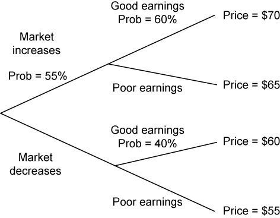

### Question 1

If random variable Y follows a lognormal distribution then the natural log of Y must be:

- A) normally distributed.
- B) denoted as ex.
- C) lognormally distributed.

(Module 6.1, LOS 6.a)

#### **解答**
対数正規分布に従うランダム変数については、その自然対数（ln）を取ると正規分布に従う。つまり、Yが対数正規分布に従う場合、ln(Y)は正規分布になる。

#### **答え : A**

---

### Question 2

Which of the following statements describes a limitation of Monte Carlo simulation?

- A) Outcomes of a simulation can only be as accurate as the inputs to the model.
- B) Simulations do not consider possible input values that lie outside historical experience.
- C) Variables are assumed to be normally distributed but may actually have non-normal distributions.

(Module 6.1, LOS 6.b)

#### **解答**
モンテカルロシミュレーションは任意の分布や任意の値域で入力を設定できるが、その出力は仮定した入力（分布や範囲）の精度に依存する。したがって、入力の想定が不適切であれば、シミュレーションの結果も正確ではなくなる。

#### **答え : A**

---

### Question 3

An analyst calculates a winsorized mean return of 3.2% for an investment fund. This measure most likely:

- A) replaces outliers with less extreme returns.
- B) equally weights all returns.
- C) captures the compounded growth rate of the fund.

(Module 3.1, LOS 3.a)

#### **解答**
ウィンザー平均（Winsorized Mean）は、外れ値処理のために使用される手法であり、極端な値（上下の5%など）をより穏やかな値（例えば5パーセンタイルや95パーセンタイル）に置き換えることで、データの影響を抑制する。これはデータの中心傾向をより代表するものにするためである。

#### **答え : A**

---

### Question 4

Which of the following return measures is best described as purely representing time preference?

- A) Real risk-free interest rate.
- B) Total rate of return.
- C) Nominal risk-free interest rate.

(Module 1.1, LOS 1.a)

#### **解答**
実質リスクフリー金利（Real Risk-Free Rate）は、リスクもインフレも考慮しない純粋な時間選好（今日の消費を将来の消費より好む程度）を反映するものである。他のリターン指標（例えば名目リスクフリー金利やトータルリターン）は、リスクやインフレ期待も含まれている。

#### **答え : A**

---

### Question 5

What are the median and the third quintile of the following data points, respectively?

9.2%, 10.1%, 11.5%, 11.9%, 12.2%, 12.8%, 13.1%, 13.6%, 13.9%, 14.2%, 14.8%, 14.9%, 15.4%

- A) 13.1%; 13.7%.
- B) 12.8%; 13.6%.
- C) 13.1%; 13.6%.

(Module 3.1, LOS 3.a)

#### **解答**
中央値（メディアン）はデータの中央にある値で、13個のデータのうち7番目、すなわち13.1%が該当する。第3クインタイル（60%地点）は、順位8.4番目となり、8番目と9番目（13.6%と13.9%）の間を線形補間して計算する。計算式は、  
$$
13.6\% + 0.4 \times (13.9\% - 13.6\%) = 13.72\%
$$  
よって、第三クインタイルは13.7%となる。

#### **答え : A**

---

### Question 6

Consider the following statements about the geometric and arithmetic means as measures of central tendency. Which statement is least accurate?

- A) The geometric mean calculates the rate of return that would have to be earned each year to match the actual, cumulative investment performance.
- B) The geometric mean may be used to estimate the average return over a one-period time horizon because it is the average of one-period returns.
- C) The difference between the geometric mean and the arithmetic mean increases with an increase in variability between period-to-period observations.

(Module 3.1, LOS 3.a)

#### **解答**
幾何平均（Geometric Mean）は、複数期間の総合パフォーマンスを1年あたりのリターンに換算するものであり、実際の累積投資成果と一致するような年率リターンを示す。一方で、1期間のリターンの単純平均（つまり1期間リターンの平均）には算術平均（Arithmetic Mean）が使われるため、「幾何平均を1期間リターンの推定に用いる」という記述は不正確である。また、時系列の変動性が高まると、算術平均と幾何平均の差は大きくなる。

#### **答え : B**

---

### Question 7

An auditor who decides to handpick rather than randomly select transactions to examine for instances of fraud is most likely using:

- A) convenience sampling.
- B) judgmental sampling.
- C) cluster sampling.

(Module 7.1, LOS 7.a)

#### **解答**
監査人が不正の兆候を探るためにトランザクションを手作業で選択する場合、それは「判断サンプリング（Judgmental Sampling）」に該当する。これは、統計的なランダム選択ではなく、専門的な判断に基づいてサンプルを選定する方法である。

#### **答え : B**

---

### Question 8

A pure discount instrument with a face value of €1 million matures eight years from today. If its yield to maturity is –1.5%, its price today is closest to:

- A) €0.89 million.
- B) €0.98 million.
- C) €1.13 million.

(Module 2.1, LOS 2.a)

#### **解答**
ゼロクーポン債（Pure Discount Instrument）は満期時にのみ額面金額を受け取る証券であり、通常、利回りがプラスであれば現在価値は額面より小さくなる。しかし、利回りがマイナスであれば、現在価値は額面よりも高くなる。本設問では利回りが–1.5%であるため、現在の価格は額面の€1,000,000よりも高くなる。  
計算式は以下：  
$$
\text{価格} = \frac{1,000,000}{(1 - 0.015)^8} \approx 1,128,522
$$  
よって、正解は€1.13 millionに最も近い。

#### **答え : C**

---

### Question 9

An economist estimates a 60% probability that the economy will expand next year. The technology sector has a 70% probability of outperforming the market if the economy expands and a 10% probability of outperforming the market if the economy does not expand. Given the new information that the technology sector will not outperform the market, the probability that the economy will not expand is closest to:

- A) 54%
- B) 33%
- C) 67%

(Module 4.1, LOS 4.c)

#### **解答**
新たな情報（テクノロジーセクターが市場をアウトパフォームしなかった）をもとにベイズの定理を使用して確率を更新する。

まず、それぞれの確率を整理する。  
経済が拡大しない確率：  
$$
P(\text{not expand}) = 1 - 0.60 = 0.40
$$

経済が拡大しない場合にテクノロジーセクターがアウトパフォームしない確率：  
$$
P(\text{not outperform | not expand}) = 1 - 0.10 = 0.90
$$

経済が拡大する場合にテクノロジーセクターがアウトパフォームしない確率：  
$$
P(\text{not outperform | expand}) = 1 - 0.70 = 0.30
$$

テクノロジーセクターがアウトパフォームしない全体確率：  
$$
P(\text{not outperform}) = (0.90 \times 0.40) + (0.30 \times 0.60) = 0.36 + 0.18 = 0.54
$$

求める確率は、  
$$
P(\text{not expand | not outperform}) = \frac{0.90 \times 0.40}{0.54} = \frac{0.36}{0.54} = 0.67
$$

#### **答え : C**

---

### Question 10

For a given stated annual rate of return, compared to the effective rate of return with discrete compounding, the effective rate of return with continuous compounding will be:

- A) the same
- B) lower
- C) higher

(Module 1.3, LOS 1.d)

#### **解答**
一般に、複利の頻度が高くなるほど（年1回→半年→四半期→毎日→連続複利）、実効利回り（effective rate of return）は高くなる。  
連続複利（continuous compounding）は無限に高頻度な複利計算であり、離散的な複利（discrete compounding）と比較して必ず実効利回りが高くなる。

#### **答え : C**

---

### Question 11

If the probability of a Type I error decreases, then the probability of:

- A) a Type II error increases
- B) incorrectly rejecting the null increases
- C) incorrectly accepting the null decreases

(Module 8.1, LOS 8.a)

#### **解答**
タイプIエラー（帰無仮説を誤って棄却する確率）の確率が減少すると、通常はタイプIIエラー（実際には偽である帰無仮説を誤って採択してしまう確率）が増加する。帰無仮説は「受け入れる」と表現せず、「棄却に失敗する」と記述するのが統計的に正確である。

#### **答え : A**

---

### Question 12

There is a 40% probability that an investment will earn 10%, a 40% probability that the investment will earn 12.5%, and a 20% probability that the investment will earn 30%. What are the mean expected return and the standard deviation of expected returns, respectively?

- A) 15.0%; 5.75%
- B) 15.0%; 7.58%
- C) 17.5%; 5.75%

(Module 4.1, LOS 4.a)

#### **解答**
期待リターン（平均値）は  
$$
(0.4)(10) + (0.4)(12.5) + (0.2)(30) = 15\%
$$

分散は  
$$
(0.4)(10-15)^2 + (0.4)(12.5-15)^2 + (0.2)(30-15)^2 = 57.5
$$

標準偏差は  
$$
\sqrt{57.5} = 7.58
$$

#### **答え : B**

---

### Question 13

Use the following probability distribution.

| State of the Economy | Probability | Return on Portfolio |
| :------------------- | :---------- | :------------------ |
| Boom                  | 0.30        | 15%                 |
| Bust                  | 0.70        | 3%                  |

The expected return for the portfolio is:

- A) 9.0%
- B) 8.1%
- C) 6.6%

(Module 5.1, LOS 5.a)

#### **解答**
期待リターンは各リターンと確率の積の合計で求める。

$$
(0.30)(15\%) + (0.70)(3\%) = 4.5\% + 2.1\% = 6.6\%
$$

#### **答え : C**

---

### Question 14

A distribution that is more peaked than a normal distribution is termed:

- A) skewed
- B) leptokurtic
- C) platykurtic

(Module 3.2, LOS 3.c)

#### **解答**
正規分布より尖った（peaked）分布はレプトカーティック（leptokurtic）と呼ばれる。レプトカーティック分布は通常より太い裾（tails）を持ち、極端な結果が発生する可能性が高い。市場リターンもレプトカーティックであることが多い。

#### **答え : B**

---

### Question 15

Stock XYZ is purchased on January 2 at a price of \12 per share. The investor receives a quarterly dividend of $0.60 per share on April 1, and the stock closes on June 30 at \13 per share. The holding period return is closest to:

- A) 8.33%
- B) 13.33%
- C) 18.33%

(Module 1.1, LOS 1.b)

#### **解答**
ホールディング・ピリオド・リターンは価格変動と配当を含めて計算する。

計算式：  
$$
\frac{P_t - P_0 + Div_t}{P_0} = \frac{13 - 12 + 0.60}{12} = \frac{1.60}{12} = 13.33\%
$$

#### **答え : B**

---

### Question 16

An investor pays $726.27 for a zero-coupon bond with a face value of $1,000 and maturing in 10 years. Bonds with similar risk profiles and with similar terms yield 3.00%. The yield to maturity for this bond is closest to:

- A) 2.75%
- B) 3.25%
- C) 3.00%

(Module 2.1, LOS 2.a)

#### **解答**
ゼロクーポン債の価格と利回り（YTM）は以下の式で関係する：  
$$
726.27 = \frac{1,000}{(1+r)^{10}}
$$  
両辺を変形すると、  
$$
(1+r)^{10} = \frac{1,000}{726.27}
$$  
よって、  
$$
1+r = \left( \frac{1,000}{726.27} \right)^{1/10} \approx 1.0325
$$  
$$
r = 0.0325 = 3.25\%
$$  
したがって利回りは3.25%となる。

#### **答え : B**

---

### Question 17

An investor looks at her monthly brokerage statement and notices that the yield to maturity on her 5-year corporate bond with a 4% annual coupon rate has gone from 4.2% last month to 3.8% this month. The statement will reflect a bond price that, over the last month, has:

- A) remained flat
- B) increased
- C) decreased

(Module 2.2, LOS 2.b)

#### **解答**
債券価格と利回り（YTM）は逆の動きをするため、YTMが4.2%から3.8%に下落したので、債券価格は上昇している。

#### **答え : B**

---

### Question 18

Personal Advisers, Inc., has determined four possible economic scenarios and has projected the portfolio returns for two portfolios for their client under each scenario. Given this information, what is the covariance of the returns on Portfolio A and Portfolio B?

- A) 0.002019
- B) 0.001898
- C) 0.890223

(Module 5.1, LOS 5.b)

#### **解答**
共分散は次式で求める：  
$$
\text{Cov}(RA, RB) = \sum P(S) \times (RA - E(RA)) \times (RB - E(RB))
$$  
期待リターン  
$$
E(RA) = 11.65\%,\quad E(RB) = 12.55\%
$$  
各シナリオで計算し合計すると共分散は0.001898となる。

#### **答え : B**

---

### Question 19

A loan of $15,000 is to be paid off in monthly payments over 5 years at 12% annual interest. What is the amount of each payment?

- A) $4,161
- B) $1,802
- C) $334

(Module 2.1, LOS 2.a)

#### **解答**
ローンの月額支払いは以下で求める：

$$
I = 1\% \quad (12\% ÷ 12), \quad N = 60 \quad (5 \times 12), \quad PV = 15,000
$$  
金融電卓で計算すると、  
$$
PMT = 333.67 \approx 334
$$

#### **答え : C**

---

### Question 20

Compute the standard deviation of a two-stock portfolio if stock A (40% weight) has a variance of 0.0015, stock B (60% weight) has a variance of 0.0021, and the correlation coefficient for the two stocks is –0.35?

- A) 2.64%
- B) 1.39%
- C) 0.07%

(Module 5.1, LOS 5.a)

#### **解答**
ポートフォリオ標準偏差の計算式は：  
$$
\sigma_p = \sqrt{W_1^2\sigma_1^2 + W_2^2\sigma_2^2 + 2W_1W_2\sigma_1\sigma_2\rho}
$$  
ここで  
$$
\sigma_1 = \sqrt{0.0015},\quad \sigma_2 = \sqrt{0.0021}
$$  
計算すると標準偏差は2.64%。

#### **答え : A**

---

### Question 21

A distribution that has positive excess kurtosis is:

- A) more skewed than a normal distribution
- B) more peaked than a normal distribution
- C) less peaked than a normal distribution

(Module 3.2, LOS 3.c)

#### **解答**
正の超過尖度（エクセス・カータシス）を持つ分布は、正規分布よりも尖った形（ピークが高く、裾が厚い）になります。

#### **答え : B**

---

### Question 22

The goal of resampling and the use of subsamples is to estimate parameters for the:

- A) various subsamples
- B) overall population
- C) original sample

(Module 6.1, LOS 6.c)

#### **解答**
リサンプリングやサブサンプルの使用は、母集団のパラメータ（例えば平均や分散）を推定することを目的としています。

#### **答え : B**

---

### Question 23

Over the last four years, an investor's portfolio has the following returns: 5.26%, –2.10%, 3.86%, and 8.18%. The arithmetic mean return is closest to:

- A) 3.76%
- B) 3.80%
- C) 3.73%

(Module 1.1, LOS 1.b)

#### **解答**
算術平均は、リターンの合計をリターンの数で割ったものです：  
$$
\frac{0.0526 + (-0.0210) + 0.0386 + 0.0818}{4} = 0.0380 = 3.80\%
$$

#### **答え : B**

---

### Question 24

Assume an investor makes the following investments:

Today, she purchases a share of stock in Redwood Alternatives for $50.00.  
After one year, she purchases an additional share for $75.00.  
After one more year, she sells both shares for $100.00 each.  
Dividends: Year 1 = $5.00, Year 2 = $7.50

The time-weighted return is:

- A) 51.4%
- B) 51.7%
- C) 23.2%

(Module 1.2, LOS 1.c)

#### **解答**
まず各期間の保有期間リターン（HPR）を計算します：

1年目：  
$$
\text{HPR1} = \frac{75 - 50 + 5}{50} = 0.60 = 60\%
$$

2年目：  
$$
\text{HPR2} = \frac{100 - 75 + 7.5}{75} = 0.433 = 43.3\%
$$

次に、2期間のリターンを幾何平均で計算：  
$$
\sqrt{(1+0.60)(1+0.433)} - 1 = 0.5142 = 51.4\%
$$

#### **答え : A**

---

### Question 25

An analyst announces that an increase in the discount rate next quarter will double her earnings forecast for a firm. This is an example of a:

- A) conditional expectation
- B) use of Bayes' formula
- C) joint probability

(Module 4.1, LOS 4.b)

#### **解答**
条件付き期待値（conditional expectation）は、ある事象が発生した場合に結果がどう変化するかを示すものです。このケースでは、ディスカウントレートの上昇という条件に基づいて利益予想が変わると述べています。

#### **答え : A**

---

### Question 26

The estimated slope coefficient in a simple linear regression is:

- A) the predicted value of the dependent variable, given the actual value of the independent variable
- B) the change in the independent variable, given a one-unit change in the dependent variable
- C) the ratio of the covariance of the regression variables to the variance of the independent variable

(Module 10.1, LOS 10.a)

#### **解答**
単回帰分析における推定傾き係数（スロープ係数）は、独立変数の分散に対する独立変数と従属変数の共分散の比率で表されます。傾き係数は、「独立変数が1単位変化したときに、従属変数がどれだけ変化するか」を示します。予測値には切片も関与します。

#### **答え : C**

---

### Question 27

Which technique for estimating the standard error of the sample mean involves calculating multiple means from the same sample, each with one observation removed from the sample?

- A) Sample variance
- B) Jackknife
- C) Bootstrap

(Module 7.1, LOS 7.c)

#### **解答**
ジャックナイフ（Jackknife）法とは、元のサンプルから1つずつ観測値を除いたサブサンプルごとに平均を計算し、その標準偏差を用いて標本平均の標準誤差を推定する方法です。

#### **答え : B**

---

### Question 28

If an analyst wants to perform hypothesis testing using a chi-square test, which of the following values is he most likely assessing?

- A) The value of a population variance
- B) The value of a population mean
- C) Whether two population variances are equal

(Module 8.2, LOS 8.b)

#### **解答**
カイ二乗検定（χ²検定）は、母分散の値を検定するために使用されます。母平均の検定にはt検定またはz検定、2つの母分散の等しさの検定にはF検定が使われます。

#### **答え : A**

---

### Question 29

Which of the following portfolios provides the best "safety first" ratio if the minimum acceptable return is 6%?

Portfolio | Expected Return (%) | Standard Deviation (%)
:---|:---|:---
1 | 13 | 5
2 | 11 | 3
3 | 9 | 2

- A) 2
- B) 3
- C) 1

(Module 5.1, LOS 5.c)

#### **解答**
ロイのセーフティーファースト基準（SF比率）は次式で求めます：

$$
\text{SF比率} = \frac{\text{期待収益率} - \text{閾値収益率}}{\text{標準偏差}}
$$

計算すると：

- ポートフォリオ1: (13 - 6) / 5 = 1.40
- ポートフォリオ2: (11 - 6) / 3 = 1.67
- ポートフォリオ3: (9 - 6) / 2 = 1.50

最も高いSF比率はポートフォリオ2の1.67です。

#### **答え : A**

---

### Question 30

For a positively skewed distribution, the median is greater than:

- A) the mean, but less than the mode
- B) the mode, but less than the mean
- C) both the mode and the mean

(Module 3.2, LOS 3.c)

#### **解答**
正の歪度（右に長い裾）を持つ分布では、平均（Mean）が中央値（Median）より大きく、中央値は最頻値（Mode）より大きいです。  
つまり、**モード < メディアン < 平均** の順になります。

#### **答え : B**

---

### Question 31

A Type I error is made when the researcher:

- A) fails to reject the null hypothesis when it is actually false
- B) rejects the alternative hypothesis when it is actually true
- C) rejects the null hypothesis when it is actually true

(Module 8.1, LOS 8.a)

#### **解答**
タイプIエラーとは、帰無仮説が正しいにもかかわらず、それを棄却してしまう誤りのことです。つまり「誤って真を棄却する」誤り（false positive）です。タイプIIエラーは、帰無仮説が偽であるにもかかわらず、それを棄却できない誤り（false negative）です。

#### **答え : C**

---

### Question 32

Ron Jacobi, manager with the Toulee Department of Natural Resources, is responsible for setting catch-and-release limits for Lake Norby, a large and popular fishing lake. He takes a sample to determine whether the mean length of Northern Pike in the lake exceeds 18 inches. If the sample t-statistic indicates that the mean length of the fish is significantly greater than 18 inches, when the population mean is actually 17.8 inches, the t-test resulted in:

- A) a Type I error only
- B) a Type II error only
- C) both a Type I and a Type II error

(Module 8.2, LOS 8.b)

#### **解答**
帰無仮説が正しいにもかかわらず（実際の平均が18インチ未満にもかかわらず）、それを棄却してしまった場合、これはタイプIエラーです。タイプIエラーとタイプIIエラーが同時に発生することはありません。

#### **答え : A**

---

### Question 33

A dataset contains six values, none of which are equal. The arithmetic mean of the data is 13.25, and the geometric mean of the data is 12.75. The harmonic mean will be:

- A) between 12.75 and 13.25
- B) less than 12.75
- C) greater than 13.25

(Module 1.1, LOS 1.b)

#### **解答**
値がすべて等しくない場合、調和平均（harmonic mean）は幾何平均（geometric mean）より小さくなり、幾何平均は算術平均（arithmetic mean）より小さくなります。よって、この場合、調和平均は12.75よりも小さくなります。

#### **答え : B**

---

### Question 34

A conditional expectation involves:

- A) determining the expected joint probability
- B) refining a forecast because of the occurrence of some other event
- C) calculating the conditional variance

(Module 4.1, LOS 4.b)

#### **解答**
条件付き期待値（conditional expectation）とは、ある事象が起きたという新たな情報をもとに予測を更新することを意味します。事前の予想を、追加情報に基づいて修正するものです。

#### **答え : B**

---

### Question 35

Lucy James, CFA, is constructing a hypothesis test using a 5% level of significance. If she is interested in increasing the "power of the test," she should consider:

- A) keeping the significance level the same and increasing the sample size
- B) increasing the probability of a Type II error
- C) lowering the level of significance

(Module 8.2, LOS 8.b)

#### **解答**
検定力（power of the test）とは、「偽の帰無仮説を正しく棄却できる確率」を意味し、1 − タイプIIエラーの確率で表されます。検定力を高めるためには、有意水準（タイプIエラー率）を変えずに標本サイズを大きくすることが効果的です。有意水準を下げたり、タイプIIエラーの確率を高めたりすると検定力は低下してしまいます。

#### **答え : A**

---

### Question 36

For a unimodal distribution with negative skewness:

- A) the median is greater than the mean
- B) the mean is greater than the mode
- C) the mode is less than the median

(Module 3.2, LOS 3.c)

#### **解答**
負の歪度（左に引っ張られた形状）を持つ単峰性（unimodal）分布では、一般に「平均値＜中央値＜最頻値（モード）」という順番になります。このため、中央値は平均値よりも大きくなります。

#### **答え : A**

---

### Question 37

An investor has a $12,000 portfolio consisting of $7,000 in stock P with an expected return of 20% and $5,000 in stock Q with an expected return of 10%. What is the investor's expected return on the portfolio?

- A) 30.0%
- B) 15.8%
- C) 15.0%

(Module 3.1, LOS 3.a)

#### **解答**
ポートフォリオの期待収益率は、各資産の収益率にポートフォリオ内での比率を掛けて合計して求めます。

$$
期待収益率 = 20\% \times \frac{7}{12} + 10\% \times \frac{5}{12} = 11.67\% + 4.17\% = 15.83\%
$$

よって、期待収益率は約15.8%です。

#### **答え : B**

---

### Question 38

Given investors require an annual return of 12.5%, a perpetual bond (i.e., a bond with no maturity/due date) that pays $87.50 a year in interest should be valued at:

- A) $70
- B) $700
- C) $1,093

(Module 2.1, LOS 2.a)

#### **解答**
永久債（償還期限なしの債券）の価値は、次の式で求めます。

$$
価値 = \frac{支払利息}{必要利回り} = \frac{87.5}{0.125} = 700
$$

よって、債券の価値は700ドルです。

#### **答え : B**

---

### Question 39

If a random variable x is lognormally distributed then ln x is:

- A) abnormally distributed
- B) defined as ex
- C) normally distributed

(Module 6.1, LOS 6.a)

#### **解答**
任意の変数 \( x \) が対数正規分布（lognormal distribution）に従う場合、その自然対数（ln x）は正規分布（normal distribution）に従います。

#### **答え : C**

---

### Question 40

Bo Rigley, CFA, is a financial analyst examining large-cap equity returns over a calendar year. His sample size is 252 trading days, and he observes a mean return of 0.07% and a standard deviation of 0.12%. With his null hypothesis that the daily portfolio return is equal to zero and a 10% level of significance, Rigley will:

- A) not reject the null because the test statistic is less than the critical value
- B) reject the null because the test statistic is greater than the critical value
- C) not reject the null because the test statistic is greater than the critical value

(Module 8.2, LOS 8.b)

#### **解答**
標本サイズ252に対して、標準誤差は以下の通りです。

$$
S_{\bar{x}} = \frac{s}{\sqrt{n}} = \frac{0.12\%}{\sqrt{252}} = 0.00756\%
$$

検定統計量は次の通りです。

$$
\frac{0.07\%}{0.00756\%} = 9.26
$$

有意水準10%での双方向検定の臨界値は±1.645なので、9.26 > 1.645 であり、帰無仮説は棄却されます。

#### **答え : B**

---

### Question 41

An analyst takes a sample of yearly returns of aggressive growth funds resulting in the following data set: 25, 15, 35, 45, and 55. The mean absolute deviation (MAD) of the data set is closest to:

- A) 20
- B) 12
- C) 16

(Module 3.1, LOS 3.b)

#### **解答**
平均値は
$$
\frac{25 + 15 + 35 + 45 + 55}{5} = 35
$$
各データから平均を引いた絶対値を合計して割ると、
$$
\frac{(|25-35|+|15-35|+|35-35|+|45-35|+|55-35|)}{5} = \frac{10+20+0+10+20}{5} = 12
$$
よって、MADは12です。

#### **答え : B**

---

### Question 42

A perpetual bond with a face value of $100,000 pays annual interest of 5%. The bond is quoted at a yield of 7%. The bond's price is closest to:

- A) $71,500
- B) $98,100
- C) $140,000

(Module 2.1, LOS 2.a)

#### **解答**
永久債の価格は
$$
\text{価格} = \frac{支払利息}{利回り} = \frac{100,000 \times 0.05}{0.07} = 71,428.57
$$
よって約71,500ドルです。

#### **答え : A**

---

### Question 43

There is a 60% chance that the economy will be good next year and a 40% chance that it will be bad. If the economy is good, there is a 70% chance that XYZ Incorporated will have EPS of $5.00 and a 30% chance that their earnings will be $3.50. If the economy is bad, there is an 80% chance that XYZ Incorporated will have EPS of $1.50 and a 20% chance that their earnings will be $1.00. What is the firm's expected EPS?

- A) $2.75
- B) $5.95
- C) $3.29

(Module 4.1, LOS 4.a)

#### **解答**
各状態の期待EPSは次の通りです。

良い経済：
$$
0.6 \times (0.7 \times 5.0 + 0.3 \times 3.5) = 0.6 \times (3.5 + 1.05) = 0.6 \times 4.55 = 2.73
$$
悪い経済：
$$
0.4 \times (0.8 \times 1.5 + 0.2 \times 1.0) = 0.4 \times (1.2 + 0.2) = 0.4 \times 1.4 = 0.56
$$
合計すると
$$
2.73 + 0.56 = 3.29
$$
よって期待EPSは3.29ドルです。

#### **答え : C**

---

### Question 44

Based on the advice of his financial advisor regarding dollar cost averaging, a client invests $2,000 each month into a blue-chip stock. The stock price on the date of purchase each month over a four-month stretch was $12, $14, $11, and $9. Using the harmonic mean, the average cost per share of the stock is closest to:

- A) $11.50
- B) $11.75
- C) $11.20

(Module 1.1, LOS 1.b)

#### **解答**
調和平均は次の式で求めます。

$$
\text{調和平均} = \frac{4}{\frac{1}{12} + \frac{1}{14} + \frac{1}{11} + \frac{1}{9}} = 11.2113
$$
よって、最も近いのは11.20ドルです。

#### **答え : C**

---

### Question 45

An investor buys a stock on March 24 for $63.25. The stock pays quarterly dividends of $0.54 on May 1 and August 1. On September 27, the investor sells the stock for $62.80. The investor's holding period return is closest to:

- A) 2.5%
- B) 1.0%
- C) 2.0%

(Module 1.1, LOS 1.b)

#### **解答**
配当を含めたトータルリターンは

$$
\text{HPR} = \frac{62.80 + 0.54 + 0.54}{63.25} - 1 = \frac{63.88}{63.25} - 1 = 0.00996 \approx 1.0\%
$$

よって、保有期間リターンは約1.0%です。

#### **答え : B**

---

### Question 46

Tully Advisers, Inc., has determined four possible economic scenarios and has projected the portfolio returns for two portfolios for their client under each scenario. Tully's economist has estimated the probability of each scenario as shown in the table below. Given this information, what is the expected return on Portfolio A?

Scenario | Probability | Return on Portfolio A | Return on Portfolio B  
:--|:--|:--|:--
A | 15% | 17% | 19%
B | 20% | 14% | 18%
C | 25% | 12% | 10%
D | 40% | 8% | 9%

- A) 11.55%
- B) 12.75%
- C) 12.55%

(Module 4.1, LOS 4.a)

#### **解答**
ポートフォリオAの期待リターンはリターンと確率の加重平均で求めます。

$$
期待リターン = (0.15 \times 0.17) + (0.20 \times 0.14) + (0.25 \times 0.12) + (0.40 \times 0.08) = 0.1155
$$

つまり期待リターンは11.55%です。

#### **答え : A**

---

### Question 47

For a test of independence based on contingency table data, the test statistic is calculated as the:

- A) sum of differences between each table cell’s actual value and its expected value, if the two characteristics are independent.
- B) mean absolute deviation of all table cells’ actual values and their expected values, if the two characteristics are independent.
- C) sum of squared differences between each table cell’s actual value and its expected value, if the two characteristics are independent.

(Module 9.1, LOS 9.b)

#### **解答**
独立性の検定において、カイ二乗統計量は**各セルの実測値と期待値の二乗差の総和**で計算されます。これにより、観測値と期待値の間のずれを測定し、2つの特性が独立であるかを検定します。

#### **答え : C**

---

### Question 48

What does it mean to say that an observation is at the sixty-fifth percentile?

- A) 65% of all the observations are above that observation.
- B) The observation falls within the 65th of 100 intervals.
- C) 65% of all the observations are below that observation.

(Module 3.1, LOS 3.a)

#### **解答**
65パーセンタイルとは、その観測値より下に**65%の観測値が存在する**ことを意味します。

#### **答え : C**

---

### Question 49

Consider the following analysis of variance (ANOVA) table:

| Source | Sum of squares | Degrees of freedom | Mean sum of squares |
|:--|:--|:--|:--|
| Regression | 550 | 1 | 550.000 |
| Error | 750 | 38 | 19.737 |
| Total | 1,300 | 39 |  |

The F-statistic for the test of the fit of the model is closest to:

- A) 27.87
- B) 0.42
- C) 0.97

(Module 10.2, LOS 10.d)

#### **解答**
F統計量は次式で求めます。

$$
F = \frac{回帰平方和}{誤差平方和} = \frac{550}{19.737} \approx 27.867
$$

したがって、F統計量は約27.87です。

#### **答え : A**

---

### Question 50

If the true mean of a population is 16.62, according to the central limit theorem, the mean of the distribution of sample means, for all possible sample sizes n will be:

- A) 16.62
- B) 16.62 / √n
- C) indeterminate for sample with n < 30

(Module 7.1, LOS 7.b)

#### **解答**
中心極限定理によれば、**すべてのサンプルサイズnにおいて、サンプル平均の分布の平均は母集団の平均に等しい**です。したがって答えは16.62です。
なお、n > 30という条件は、サンプル平均の分布が**正規分布に近づくために必要な条件**であり、平均値自体には影響しません。

#### **答え : A**

---

### Question 51

Under which of these conditions is a machine learning model said to be underfit?

- A) The model identifies spurious relationships.
- B) The input data are not labeled.
- C) The model treats true parameters as noise.

(Module 11.1, LOS 11.b)

#### **解答**
アンダーフィッティングとは、機械学習モデルがデータに対して十分に複雑でなく、適切なパターンや関係性を捉えられていない状態を指します。この場合、モデルは**本来のパターンをノイズとして扱い**、重要な特徴を見逃してしまいます。

#### **答え : C**

---

### Question 52

An investment product promises to pay a lump sum of $25,458 at the end of 9 years. If an investor feels this investment should produce a rate of return of 14%, compounded annually, the present value is closest to:

- A) $7,618.00.
- B) $9,426.00.
- C) $7,829.00.

(Module 2.1, LOS 2.a)

#### **解答**
将来価値が$25,458、利回り14%、期間9年で割引現在価値を求めます。

$$
PV = \frac{25,458}{(1+0.14)^9} = 7,828.54
$$

電卓でも、N=9、I/Y=14、FV=−25,458、PMT=0と入力し、CPT→PV=7,828.54と求まります。

#### **答え : C**

---

### Question 53

A data analyst compares the P/E ratios for two companies over a period of 20 years and calculates a two-tailed F-statistic that exceeds the critical F-statistic value. As a result of her findings, she will:

- A) reject the null hypothesis that the P/E ratio variances between the two companies are significantly different.
- B) not reject the null hypothesis that the P/E ratio variances between the two companies are significantly different.
- C) reject the null hypothesis that the P/E ratio variances between the two companies are not significantly different.

(Module 8.2, LOS 8.b)

#### **解答**
F検定では、帰無仮説が「2つの母分散は等しい」であり、対立仮説が「2つの母分散は等しくない」です。F統計量が臨界値を超えたため、**帰無仮説（等しい）を棄却**し、P/E比の分散は有意に異なると結論付けます。

#### **答え : C**

---

### Question 54

Find the respective mean and the mean absolute deviation (MAD) of a series of stock market returns.

Year 1: 14%  
Year 2: 20%  
Year 3: 24%  
Year 4: 22%

- A) 20%; 3%.
- B) 20%; 12%.
- C) 22%; 3%.

(Module 3.1, LOS 3.b)

#### **解答**
平均は  
$$
\frac{14 + 20 + 24 + 22}{4} = 20
$$

MADは、各リターンと平均の絶対差の平均です。

$$
\text{MAD} = \frac{|14-20| + |20-20| + |24-20| + |22-20|}{4} = \frac{6 + 0 + 4 + 2}{4} = 3
$$

#### **答え : A**

---

### Question 55

The power of the test is:

- A) equal to the level of confidence.
- B) the probability of rejecting a false null hypothesis.
- C) the probability of rejecting a true null hypothesis.

(Module 8.1, LOS 8.a)

#### **解答**
検定のパワー（power）は、**偽の帰無仮説を正しく棄却する確率**を意味します。これは1−β（βは第2種の過誤の確率）として表され、検定の正確性を示します。

#### **答え : B**

---

### Question 56

A distribution with a mode of 10 and a range of 2 to 25 would most likely be:

- A) normally distributed.
- B) positively skewed.
- C) negatively skewed.

(Module 3.2, LOS 3.c)

#### **解答**
モードが10、範囲が2から25という分布では、モードから右側の距離（$$25-10=15$$）が左側の距離（$$10-2=8$$）よりも長いため、右に長い尾を持つ、すなわち正の歪み（positively skewed）であると判断できます。

#### **答え : B**

---

### Question 57

Expected returns and standard deviations of returns for three portfolios are shown in the following table:

Portfolio | Expected Return | Standard Deviation
| --- | --- | --- |
1 | 9% | 5%  
2 | 8% | 4%  
3 | 7% | 3%

Assuming the risk-free rate is 3%, an investor who wants to minimize the probability of returns less than 5% should choose:

- A) Portfolio 1.
- B) Portfolio 3.
- C) Portfolio 2.

(Module 5.1, LOS 5.c)

#### **解答**
リターンが5%未満となる確率を最小化するには、セーフティファースト基準を最大化するポートフォリオを選びます。ポートフォリオごとのセーフティファースト比率はそれぞれ  
$$ \text{Portfolio 1} = \frac{9-5}{5} = 0.80 $$  
$$ \text{Portfolio 2} = \frac{8-5}{4} = 0.75 $$  
$$ \text{Portfolio 3} = \frac{7-5}{3} = 0.67 $$  
よってポートフォリオ1が最適です。

#### **答え : A**

---

### Question 58

Which of the following statements regarding the central limit theorem (CLT) is least accurate? The CLT:

- A) states that for a population with mean µ and variance σ², the sampling distribution of the sample means for any sample of size n will be approximately normally distributed.
- B) holds for any population distribution with mean µ and a finite variance σ², assuming a large sample size.
- C) gives the variance of the distribution of sample means as σ² / n, where σ² is the population variance and n is the sample size.

(Module 7.1, LOS 7.b)

#### **解答**
この問題は「不正確な記述」を選ぶ問題です。中心極限定理（CLT）では、母集団の平均$\mu$、分散$\sigma^2$が有限であれば、サンプルサイズが十分大きい場合に標本平均の分布は正規分布に近づきます。Aの記述はnに関係なく「任意のサンプルサイズ」と誤解される可能性があるため、最も不正確です。

#### **答え : A**

---

### Question 59

The probability of A is 0.4. The probability of AC is 0.6. The probability of (B | A) is 0.5, and the probability of (B | AC) is 0.2. Using Bayes' formula, what is the probability of (A | B)?

- A) 0.375.
- B) 0.125.
- C) 0.625.

(Module 4.1, LOS 4.c)

#### **解答**
まず全確率の定理により  
$$ P(B) = P(B|A)P(A) + P(B|A^c)P(A^c) = (0.5)(0.4) + (0.2)(0.6) = 0.32 $$  
ベイズの定理により  
$$ P(A|B) = \frac{P(B|A)P(A)}{P(B)} = \frac{(0.5)(0.4)}{0.32} = 0.625 $$

#### **答え : C**

---

### Question 60

An analyst compiles the returns on Fund Q over the last four years:

Year 1: 4%  
Year 2: 3%  
Year 3: 2%  
Year 4: 30%

Which of the following will result in the lowest measure of the mean return?

- A) The geometric mean.
- B) The arithmetic mean.
- C) The harmonic mean.

(Module 3.1, LOS 3.a)

#### **解答**
調和平均は常に幾何平均や算術平均よりも小さくなります。  
計算は以下の通りです。  
調和平均:  
$$ \text{Harmonic Mean} = \left( \frac{1}{1.04} + \frac{1}{1.03} + \frac{1}{1.02} + \frac{1}{1.30} \right)^{-1} \times 4 - 1 = 8.64\% $$  
幾何平均:  
$$ \text{Geometric Mean} = \left( (1.04)(1.03)(1.02)(1.30) \right)^{\frac{1}{4}} - 1 = 9.17\% $$  
算術平均:  
$$ \text{Arithmetic Mean} = \frac{4\% + 3\% + 2\% + 30\%}{4} = 9.75\% $$

#### **答え : C**

---

### Question 61

A financial analyst is constructing a hypothesis test to assess whether the mean daily return on a portfolio of blue-chip stocks is statistically different from zero. The sample size is 128 trading days, the mean return is 0.14%, and the standard deviation is 0.18%. With the null hypothesis that the daily portfolio return is equal to zero, which of the following changes in variables will independently make it more likely that the null is rejected?

- A) A move of the mean return down to 0.11%.
- B) An increase in the standard deviation of the returns to 0.23%.
- C) An increase in the sample size to 140.

(Module 8.2, LOS 8.b)

#### **解答**  
サンプルサイズが増加すると標準誤差が小さくなり、結果的に検定統計量が大きくなり、帰無仮説が棄却されやすくなる。他の選択肢（平均の減少、標準偏差の増加）は検定統計量を小さくしてしまう。

#### **答え : C**

---

### Question 62

The following annualized monthly return measures have been calculated for an investment based on its performance over the last 72 months.

Arithmetic mean 6.8%  
Geometric mean 6.0%  
90% Winsorized mean 5.5%  

If for one month in the period the return was extremely high, which measure best reflects the central tendency of the investment's returns?

- A) Winsorized mean.
- B) Geometric mean.
- C) Arithmetic mean.

(Module 3.1, LOS 3.a)

#### **解答**  
外れ値の影響を抑えるためにはウィンザー平均（Winsorized mean）が最適である。算術平均や幾何平均はすべての観測値を使用するため、外れ値の影響を受けやすい。

#### **答え : A**

---

### Question 63

Assuming a constant rate of growth in dividends, we can estimate an equity share's:

- A) growth rate as the sum of its dividend yield and its required rate of return.
- B) dividend yield as the sum of its required rate of return and its growth rate.
- C) required rate of return as the sum of its dividend yield and growth rate.

(Module 2.2, LOS 2.b)

#### **解答**  
ゴードン成長モデルにより、株式の必要収益率は配当利回りと成長率の合計で表される。すなわち、$k_e = \frac{D_1}{V_0} + g_c$である。

#### **答え : C**

---

### Question 64

A portfolio's monthly returns follow a distribution with a kurtosis measure of 4.2. Relative to a portfolio with normally distributed returns, this portfolio has a:

- A) higher probability of extreme upside returns and higher chance of extreme downside returns.
- B) lower probability of extreme upside returns and higher chance of extreme downside returns.
- C) higher probability of extreme upside returns and lower chance of extreme downside returns.

(Module 3.2, LOS 3.c)

#### **解答**  
尖度が3より大きい（尖度4.2）はレプトカーティック（leptokurtic）分布を示しており、中心付近の山が高く、極端な上昇・下降の可能性がともに高くなる。

#### **答え : A**

---

### Question 65

The correlation between two variables is –0.74. The most appropriate way to interpret this correlation is that:

- A) the two variables have a negative linear association.
- B) there is unlikely to be a strong linear relationship between the two variables.
- C) if one of the variables increases, there is a 74% probability that the other variable will decrease.

(Module 3.2, LOS 3.d)

#### **解答**  
相関係数が$-0.74$である場合、二つの変数間には強い負の線形関係があることを示している。相関係数は確率そのものを示すものではない。

#### **答え : A**

---

### Question 66

Consider the following analysis of variance (ANOVA) table:

| Source      | Sum of squares | Degrees of freedom | Mean sum of squares |
|-------------|----------------|--------------------|---------------------|
| Regression  | 556            | 1                  | 556                 |
| Error       | 679            | 50                 | 13.5                |
| Total       | 1,235          | 51                 |

The R² for this regression is closest to:

- A) 0.55
- B) 0.45
- C) 0.82

(Module 10.2, LOS 10.d)

#### **解答**  
$$
R^2 = \frac{\text{回帰平方和}}{\text{全体平方和}} = \frac{556}{1235} = 0.45
$$ となる。

#### **答え : B**

---

### Question #67

To account for logarithmic variables, functional forms of simple linear regressions are available if:

- A) either the dependent or independent variable is logarithmic, but not both.
- B) the independent variable is logarithmic, but not if the dependent variable is logarithmic.
- C) either or both of the dependent and independent variables are logarithmic.

(Module 10.3, LOS 10.f)

#### **解答**  
被説明変数、説明変数のいずれかまたは両方が対数変換されている場合に、適切な回帰モデル（log-lin, lin-log, log-log）が使用できる。

#### **答え : C**

---

### Question #68

If a distribution is positively skewed, then generally:

- A) mean > median > mode.
- B) mean < median < mode.
- C) mean > median < mode.

(Module 3.2, LOS 3.c)

#### **解答**  
正の歪みがある分布では、平均 > 中央値 > 最頻値の順番になる。右側の裾が長くなり、外れ値が平均を大きく押し上げるためである。

#### **答え : A**

---

### Question #69

Twenty Level I CFA candidates in a study group took a practice exam and want to determine the distribution of their scores. When they grade their exams they discover that one of them skipped an ethics question and subsequently filled in the rest of his answers in the wrong places, leaving him with a much lower score than the rest of the group. If they include this candidate's score, their distribution will most likely:

- A) have a mean that is less than its median.
- B) be positively skewed.
- C) have a mode that is less than its median.

(Module 3.2, LOS 3.c)

#### **解答**  
極端な低得点という外れ値が存在するため、分布は負の歪み（左に長い裾）を持つ。負の歪みでは平均 < 中央値 < 最頻値となる。

#### **答え : A**

---

### Question #70

The mean and standard deviation of returns for three portfolios are listed below in percentage terms.

Portfolio X: Mean 5%, standard deviation 3%.  
Portfolio Y: Mean 14%, standard deviation 20%.  
Portfolio Z: Mean 19%, standard deviation 28%.

Using Roy's safety-first criteria and a threshold of 4%, select the optimal portfolio.

- A) Portfolio Y.
- B) Portfolio X.
- C) Portfolio Z.

(Module 5.1, LOS 5.c)

#### **解答**  
Royの安全第一基準では、$$(\text{平均} - \text{閾値})/\text{標準偏差}$$ を最大化するポートフォリオを選択する。

- Portfolio X: $(5 - 4) / 3 = 0.3333$
- Portfolio Y: $(14 - 4) / 20 = 0.5000$
- Portfolio Z: $(19 - 4) / 28 = 0.5357$

最大値を持つPortfolio Zが最適となる。

#### **答え : C**

---

### Question #71

Over a period of one year, an investor's portfolio has declined in value from 127,350 to 108,427. What is the continuously compounded rate of return?

- A) -14.86%
- B) -13.84%
- C) -16.09%

(Module 1.3, LOS 1.d)

#### **解答**  
連続複利リターンは $$ \ln\left(\frac{108,427}{127,350}\right) = -0.1609 $$ より、-16.09%となる。

#### **答え : C**

---

### Question #72

Which of the following statements about kurtosis is least accurate? Kurtosis:

- A) describes the degree to which a distribution is not symmetric about its mean.
- B) is used to reflect the probability of extreme outcomes for a return distribution.
- C) measures the peakedness of a distribution reflecting a greater or lesser concentration of returns around the mean.

(Module 3.2, LOS 3.c)

#### **解答**  
分布の非対称性は歪度（skewness）によって測定され、尖度（kurtosis）は分布のピークの高さや極端な結果の発生確率を示すため、Aが不正確である。

#### **答え : A**

---

### Question #73

In bootstrap resampling, a single observation from a full dataset:

- A) may appear either in exactly one sample or in no samples.
- B) must appear in one and only one sample.
- C) may appear in multiple samples.

(Module 6.1, LOS 6.c)

#### **解答**  
ブートストラップリサンプリングでは、復元抽出を行うため、同じ観測値が複数回サンプルに含まれることがある。

#### **答え : C**

---

### Question #74

A survey is taken to determine whether the average starting salaries of CFA charterholders is equal to or greater than \57,000 per year. Assuming a normal distribution, what is the test statistic given a sample of 115 newly acquired CFA charterholders with a mean starting salary of \65,000 and a standard deviation of \4,500?

- A) 19.06
- B) -19.06
- C) 1.78

(Module 8.2, LOS 8.b)

#### **解答**  
標本数が115と大きいためz検定を使用し、統計量は $$ z = \frac{65,000 - 57,000}{4,500 / \sqrt{115}} = \frac{8,000}{419.48} = 19.06 $$ となる。

#### **答え : A**

---

### Question #75

Tina O'Fahey, CFA, believes a stock's price in the next quarter depends on two factors: the direction of the overall market and whether the company's next earnings report is good or poor. The possible outcomes and some probabilities are illustrated in the tree diagram shown below:

Based on this tree diagram, the expected value of the stock if the market decreases is closest to:

- A) $62.50
- B) $57.00
- C) $26.00

(Module 4.1, LOS 4.b)

#### **解答**  
マーケットが下落した場合の期待値は $$ 0.4 \times 60 + 0.6 \times 55 = 57.0 $$ となる。

#### **答え : B**

---

### Question #76

A two-sided but very thick coin is expected to land on its edge twice out of every 100 flips. And the probability of face up (heads) and the probability of face down (tails) are equal. When the coin is flipped, the prize is $1 for heads, $2 for tails, and $50 when the coin lands on its edge. What is the expected value of the prize on a single coin toss?

- A) $2.47
- B) $1.50
- C) $17.67

(Module 4.1, LOS 4.a)

#### **解答**  
コインがエッジに立つ確率は0.02、表または裏になる確率はそれぞれ0.49なので、期待値は $$ (0.02 \times 50) + (0.49 \times 1) + (0.49 \times 2) = 2.47 $$ となる。

#### **答え : A**

---

### Question #77

If an investor bought a stock for $32 and sold it nine months later for $37.50 after receiving $2 in dividends, what was the holding period return on this investment?

- A) 23.44%
- B) 32.42%
- C) 17.19%

(Module 1.3, LOS 1.e)

#### **解答**  
保有期間収益率 (HPR) は $$ \frac{(2 + 37.5) - 32}{32} = 0.2344 $$ より、23.44%となる。

#### **答え : A**

---

### Question #78

Cameron Ryan wants to make an offer on the condominium he is renting. He takes a sample of prices of condominiums in his development that closed in the last five months. Sample prices are as follows (amounts are in thousands of dollars): $125, $175, $150, $155 and $135. The sample standard deviation is closest to:

- A) 370.00
- B) 19.24
- C) 38.47

(Module 3.1, LOS 3.b)

#### **解答**  
サンプル平均は 
$$ \frac{125 + 175 + 150 + 155 + 135}{5} = 148 $$
サンプル分散は 
$$ \frac{(125-148)^2 + (175-148)^2 + (150-148)^2 + (155-148)^2 + (135-148)^2}{4} = 370 $$
サンプル標準偏差は 
$$ \sqrt{370} = 19.24 $$
となる。

#### **答え : B**

---

### Question #79

To determine a confidence interval around the predicted value from a simple linear regression, the appropriate degrees of freedom are:

- A) $n - 2$
- B) $n - 1$
- C) $n$

(Module 10.3, LOS 10.e)

#### **解答**  
単回帰分析における予測値に対する信頼区間の自由度は $ n-2 $ となる。

#### **答え : A**

---

### Question #80

For a two-tailed test of hypothesis involving a z-distributed test statistic and a 5% level of significance, a calculated z-statistic of 1.5 indicates that:

- A) the null hypothesis is rejected.
- B) the null hypothesis cannot be rejected.
- C) the test is inconclusive.

(Module 8.2, LOS 8.b)

#### **解答**  
両側検定において有意水準5%の場合、棄却域の境界となるz値は ±1.96 であり、計算されたz統計量1.5はこれに達していないため、帰無仮説は棄却できない。

#### **答え : B**

---

### Question #81

The owner of a company has recently decided to raise the salary of one employee, who was already making the highest salary in the company, by 40%. Which of the following value(s) is (are) expected to be affected by this raise?

- A) median only.
- B) both mean and median.
- C) mean only.

(Module 3.1, LOS 3.a)

#### **解答**  
平均（mean）は全データの合計をデータ数で割って計算するため、最高給与者の給与が上がることで平均は上昇するが、中央値（median）は影響を受けない。

#### **答え : C**

---

### Question #82

An investor spends $365,000 purchasing zero-coupon bonds with a total face value of $500,000 and maturing in 10 years. For the annualized rate of return to be above 3.20%, the bond's price will have to be:

- A) lower than $365,000.
- B) higher than $365,000.
- C) equivalent to $365,000.

(Module 2.2, LOS 2.b)

#### **解答**  
年間利回り $r$ は次式で求める：  
$$ (1 + r)^{10} = \frac{500,000}{365,000} \quad \Rightarrow \quad r = (1.36986)^{1/10} - 1 = 3.20\% $$  
利回りを3.20%以上にするには、現在価格をさらに下げる必要がある。

#### **答え : A**

---

### Question #83

Annual Returns on ABC Mutual Fund

Yr 1 | Yr 2 | Yr 3 | Yr 4 | Yr 5 | Yr 6 | Yr 7 | Yr 8 | Yr 9 | Yr 10  
---|---|---|---|---|---|---|---|---|---  
11.0% | 12.5% | 8.0% | 9.0% | 13.0% | 7.0% | 15.0% | 2.0% | -16.5% | 11.0%

Assuming a mean of 7.2%, what is the sample standard deviation of the returns for ABC Mutual Fund for the period from Year 1 to Year 10?

- A) 9.1%.
- B) 9.8%.
- C) 7.8%.

(Module 3.1, LOS 3.b)

#### **解答**  
標本標準偏差は次式で求める：  
$$ \text{標準偏差} = \sqrt{ \frac{ \sum (x_i - \bar{x})^2 }{n-1} } = \sqrt{ \frac{744.10}{9} } = 9.1\% $$

#### **答え : A**

---

### Question #84

Joe Mayer, CFA, projects that XYZ Company's return on equity varies with the state of the economy in the following way:

State of Economy | Probability of Occurrence | Company Returns  
---|---|---  
Good | 0.20 | 20%  
Normal | 0.50 | 15%  
Poor | 0.30 | 10%  

The standard deviation of XYZ's expected return on equity is closest to:

- A) 1.5%.
- B) 12.3%.
- C) 3.5%.

(Module 5.1, LOS 5.b)

#### **解答**  
期待リターン：  
$$ E(R) = (0.2 \times 20\%) + (0.5 \times 15\%) + (0.3 \times 10\%) = 14.5\% $$  
分散：  
$$ 0.2(20\%-14.5\%)^2 + 0.5(15\%-14.5\%)^2 + 0.3(10\%-14.5\%)^2 = 0.001225 $$  
標準偏差：  
$$ \sqrt{0.001225} = 0.035 = 3.5\% $$

#### **答え : C**

---

### Question #85

Which of the following statements regarding hypothesis testing is least accurate?

- A) A type II error is the acceptance of a hypothesis that is actually false.
- B) The significance level is the risk of making a type I error.
- C) A type I error is acceptance of a hypothesis that is actually false.

(Module 8.1, LOS 8.a)

#### **解答**  
タイプIエラーとは、実際には正しい帰無仮説を誤って棄却することである。選択肢Cの「タイプIエラーは実際に誤った仮説を受け入れる」という記述は誤り。

#### **答え : C**

---

### Question #86

For the last four years, the returns for XYZ Corporation's stock have been 10.4%, 8.1%, 3.2%, and 15.0%. The equivalent compound annual rate is:

- A) 9.1%.
- B) 9.2%.
- C) 8.9%.

(Module 1.2, LOS 1.c)

#### **解答**  
複利年率（CAGR）は次式で求める：  
$$ (1.104 \times 1.081 \times 1.032 \times 1.15)^{0.25} - 1 = 9.1\% $$

#### **答え : A**

---

### Question #87

An analyst evaluates a dataset with eight values. From the dataset, she calculates the geometric mean to be 8.50. If the arithmetic mean is equal to 8.90, the harmonic mean is closest to:

- A) 8.12.
- B) 8.63.
- C) 9.30.

(Module 1.1, LOS 1.b)

#### **解答**  
調和平均（harmonic mean）は次式で求める：  
$$ \text{arithmetic mean} \times \text{harmonic mean} = (\text{geometric mean})^2 $$  
$$ 8.90 \times \text{harmonic mean} = (8.50)^2 $$  
$$ \text{harmonic mean} = \frac{72.25}{8.90} = 8.12 $$

#### **答え : A**

---

### Question #88

The following table shows the weightings and expected returns for a portfolio of three stocks:

Stock | Weight | E(RX)  
---|---|---  
V | 0.40 | 12%  
M | 0.35 | 8%  
S | 0.25 | 5%

What is the expected return of this portfolio?

- A) 8.85%.
- B) 8.33%.
- C) 9.05%.

(Module 5.1, LOS 5.a)

#### **解答**  
期待リターンは加重平均で計算される：  
$$ E(R_P) = 0.40 \times 12\% + 0.35 \times 8\% + 0.25 \times 5\% = 8.85\% $$

#### **答え : A**

---

### Question #89

Given the following cash flow stream:

End of Year | Annual Cash Flow  
---|---  
1 | \$4,000  
2 | \$2,000  
3 | \$0  
4 | \(-\$1,000\)

Using a 10% discount rate, the present value of this cash flow stream is:

- A) \$3,415.00.
- B) \$3,636.00.
- C) \$4,606.00.

(Module 2.2, LOS 2.c)

#### **解答**  
各年の現在価値（PV）を合計する：  
$$ PV_1 = \frac{4,000}{(1+0.1)^1} = 3,636 $$  
$$ PV_2 = \frac{2,000}{(1+0.1)^2} = 1,653 $$  
$$ PV_3 = 0 $$  
$$ PV_4 = \frac{-1,000}{(1+0.1)^4} = -683 $$  
合計：  
$$ 3,636 + 1,653 + 0 - 683 = 4,606 $$

#### **答え : C**

---

### Question #90

For assets A and B we know the following:  
$$ E(R_A) = 0.10, \quad E(R_B) = 0.20, \quad \text{Var}(R_A) = 0.25, \quad \text{Var}(R_B) = 0.36 $$  
and the correlation of the returns is 0.6.

What is the expected return of a portfolio that is equally invested in the two assets?

- A) 0.3050
- B) 0.1500
- C) 0.2275

(Module 5.1, LOS 5.a)

#### **解答**  
期待リターンは加重平均で求める：  
$$ E(R_P) = 0.5 \times 0.10 + 0.5 \times 0.20 = 0.15 $$

#### **答え : B**

---

### Question #91

An annuity will pay eight annual payments of $100, with the first payment to be received one year from now. If the interest rate is 12% per year, what is the present value of this annuity?

- A) $1,229.97
- B) $496.76
- C) $556.38

(Module 2.1, LOS 2.a)

#### **解答**  
年利12%、8回の支払い、各回$100で年金の現在価値を求める。  
$$ N = 8, \quad I/Y = 12\%, \quad PMT = -100, \quad FV = 0 $$
計算すると現在価値は  
$$ PV = 496.76 $$

#### **答え : B**

---

### Question #92

A bond pays annual coupon interest of £60 and returns its face value of £1,000 in seven years. The bond's price today is £1,045. Its yield to maturity is closest to:

- A) 6.0%
- B) 5.2%
- C) 6.8%

(Module 2.2, LOS 2.b)

#### **解答**  
7年後に£1,000返還、年£60クーポン、現在価格£1,045。  
$$ N = 7, \quad PMT = 60, \quad FV = 1000, \quad PV = -1045 $$
計算すると  
$$ YTM = 5.2162\% $$

#### **答え : B**

---

### Question #93

An investor sold a 30-year bond at a price of $850 after he purchased it at $800 a year ago. He received $50 of interest at the time of the sale. The annualized holding period return is:

- A) 6.25%
- B) 15.0%
- C) 12.5%

(Module 1.3, LOS 1.e)

#### **解答**  
保有期間収益率（HPR）は以下で求める：  
$$ HPR = \frac{P_t - P_{t-1} + D_t}{P_{t-1}} $$
ここでは  
$$ HPR = \frac{850 - 800 + 50}{800} = 0.125 = 12.5\% $$

#### **答え : C**

---

### Question #94

Over the last five years, an investment fund's monthly returns were relatively stable apart from last year, where two extremely high returns were recorded. If the arithmetic mean for the fund's monthly returns over the period is 6.7%, a trimmed or winsorized mean return is most likely to be:

- A) higher than the arithmetic mean.
- B) equal to the arithmetic mean.
- C) lower than the arithmetic mean.

(Module 3.1, LOS 3.a)

#### **解答**  
外れ値（非常に高いリターン）を除去または調整するため、トリム平均またはウィンザー平均は通常、  
$$ \frac{\text{trimmed}}{winsorized mean} < \text{arithmetic mean} $$
となる。

#### **答え : C**

---

### Question #95

Wortel Industries has preferred stock outstanding that paying an annual dividend of $3.75 per share. If an investor wants to earn a rate of return of 8.5%, how much should he be willing to pay for a share of Wortel preferred stock?

- A) $42.10
- B) $44.12
- C) $31.88

(Module 2.1, LOS 2.a)

#### **解答**  
優先株式の価格は、配当金を必要収益率で割ることで計算できる：  
$$ \text{Price} = \frac{3.75}{0.085} = 44.12 $$

#### **答え : B**

---

### Question #96

A survey is taken to determine whether the average starting salaries of CFA charterholders is equal to or greater than \59,000 per year. What is the test statistic given a sample of 135 newly acquired CFA charterholders with a mean starting salary of \64,000 and a standard deviation of \5,500?

- A) 10.56
- B) -10.56
- C) 0.91

(Module 8.2, LOS 8.b)

#### **解答**  
大規模サンプル（n=135）なのでz統計量を使う。  
$$ z = \frac{\bar{X} - \mu}{\sigma / \sqrt{n}} = \frac{64,000 - 59,000}{5,500 / \sqrt{135}} = 10.56 $$

#### **答え : A**

---

### Question #97

An investor is choosing between two possible investments. Both have identical future cash flows in all situations, but the investor notices a slight discrepancy in price between the two. What action will this investor take based on the no-arbitrage principle?

- A) Do nothing, as there cannot be a price divergence based on the rule.
- B) Act quickly by buying the lower-priced investment, as the prices will quickly converge.
- C) Wait for the prices to further diverge, then sell the higher-priced investment.

(Module 2.2, LOS 2.c)

#### **解答**  
裁定機会が存在する場合、すぐに安い方を買うのが合理的。ノーアービトラージの原則では、価格差はすぐに解消されるとされる。

#### **答え : B**

---

### Question #98

A simple linear regression is a model of the relationship between:

- A) one dependent variable and one independent variable.
- B) one dependent variable and one or more independent variables.
- C) one or more dependent variables and one or more independent variables.

(Module 10.1, LOS 10.a)

#### **解答**  
単回帰分析（simple linear regression）は、「**1つの従属変数と1つの独立変数**」の関係を表すモデル。

#### **答え : A**

---

### Question #99

Which of the following statements regarding the distribution of returns used for asset pricing models is most accurate?

- A) Normal distribution returns are used for asset pricing models because they will only allow the asset price to fall to zero.
- B) Lognormal distribution returns are used for asset pricing models because they will not result in an asset return of less than -100%.
- C) Lognormal distribution returns are used because this will allow for negative returns on the assets.

(Module 6.1, LOS 6.a)

#### **解答**  
資産価格モデルでは**対数正規分布（lognormal distribution）**を仮定する。これは価格が負にならず、リターンが $-100\%$ 未満になることを防ぐためである。

#### **答え : B**

---

### Question #100

If given the standard deviations of the returns of two assets and the correlation between the two assets, which of the following would an analyst least likely be able to derive from these?

- A) Strength of the linear relationship between the two.
- B) Covariance between the returns.
- C) Expected returns.

(Module 5.1, LOS 5.a)

#### **解答**  
標準偏差と相関係数からは、  
- 相関の強さ  
- 共分散（$ \text{Cov}(X,Y) = \rho_{X,Y} \sigma_X \sigma_Y $）  
は計算できるが、期待リターン（中心傾向）は求められない。

#### **答え : C**

---

### Question #101

Which of the following is least likely an assumption of linear regression?

- A) The variance of the error terms each period remains the same.
- B) The error terms from a regression are positively correlated.
- C) Values of the independent variable are not correlated with the error term.

(Module 10.1, LOS 10.b)

#### **解答**  
線形回帰では誤差項同士は独立している必要があり、誤差項が正の相関を持つことは仮定違反となる。よってBが正解。

#### **答え : B**

---

### Question #102

Artificial intelligence is best described as:

- A) networks of smart devices and buildings.
- B) the field of study concerned with extracting information from data.
- C) computer systems that emulate human thinking.

(Module 11.1, LOS 11.b)

#### **解答**  
人工知能（AI）は人間の思考を模倣するコンピュータシステムを指すためCが正解。

#### **答え : C**

---

### Question #103

Given the following probability distribution, find the standard deviation of expected returns.

| Event | P(RA) | RA |
|:----|:---|:---|
| Recession | 0.10 | –5% |
| Below Average | 0.30 | –2% |
| Normal | 0.50 | 10% |
| Boom | 0.10 | 31% |

- A) 10.04%.
- B) 7.00%.
- C) 12.45%.

(Module 5.1, LOS 5.a)

#### **解答**  
期待リターンは  
$$ \text{E}(R_A) = (0.1)(-5) + (0.3)(-2) + (0.5)(10) + (0.1)(31) = 7\% $$  
分散は  
$$ \sigma^2 = (0.1)(-5-7)^2 + (0.3)(-2-7)^2 + (0.5)(10-7)^2 + (0.1)(31-7)^2 = 100.8 $$  
標準偏差は  
$$ \sigma = \sqrt{100.8} = 10.04\% $$  
よってAが正解。

#### **答え : A**

---

### Question #104

Tully Advisers, Inc., has determined four possible economic scenarios and has projected the portfolio returns for two portfolios for their client under each scenario. Given this information, what is the standard deviation of returns on portfolio A?

| Scenario | Probability | Return on Portfolio A |
|:----|:---|:---|
| A | 15% | 18% |
| B | 20% | 17% |
| C | 25% | 11% |
| D | 40% | 7% |

- A) 1.140%.
- B) 5.992%.
- C) 4.53%.

(Module 5.1, LOS 5.a)

#### **解答**  
期待リターンは  
$$ \text{E}(R_A) = 11.65\% $$  
分散は  
$$
\sigma^2 = 0.15(0.18-0.1165)^2 + 0.20(0.17-0.1165)^2 + 0.25(0.11-0.1165)^2 + 0.40(0.07-0.1165)^2 = 0.0020506
$$  
標準偏差は  
$$
\sigma = \sqrt{0.0020506} = 4.53\%
$$  
よってCが正解。

#### **答え : C**

---

### Question #105

A 15-year zero-coupon German government bond has an annualized yield of –1.5%. Assuming annual compounding, the price of the bond per €100 of principal is closest to:

- A) €115
- B) €125
- C) €105

(Module 2.1, LOS 2.a)

#### **解答**  
ゼロクーポン債の価格は  
$$ PV = \frac{FV}{(1+r)^n} $$  
ここで$FV=100$, $r=-0.015$, $n=15$なので、  
$$ PV = 100 \times (1-0.015)^{-15} = 125.45 $$  
よってBが正解。

#### **答え : B**

---

### Question #106

Which of the following statements about hypothesis testing is least accurate?

- A) The significance level is the probability of making a Type I error.
- B) A Type II error is the probability of failing to reject a null hypothesis that is not true.
- C) A Type I error is the probability of rejecting the null hypothesis when the null hypothesis is false.

(Module 8.1, LOS 8.a)

#### **解答**  
タイプIエラーとは、帰無仮説が真であるにもかかわらず棄却する確率を指すため、Cの説明は誤り。よってCが正解。

#### **答え : C**

---

### Question #107

Which of the following statements about hypothesis testing is most accurate? A Type I error is the probability of:

- A) failing to reject a false hypothesis.
- B) rejecting a true null hypothesis.
- C) rejecting a true alternative hypothesis.

(Module 8.1, LOS 8.a)

#### **解答**  
タイプIエラーは「帰無仮説が正しいにもかかわらず誤って棄却する」ことを指すため、Bが正解。

#### **答え : B**

---

### Question #108

An investor begins with a \100,000 portfolio. At the end of the first period, it generates \5,000 of income, which he does not reinvest. At the end of the second period, he contributes \25,000 to the portfolio. At the end of the third period, the portfolio is valued at \123,000. The portfolio's money-weighted return per period is closest to:

- A) 1.20%.
- B) 0.94%.
- C) –0.50%.

(Module 1.3, LOS 1.e)

#### **解答**  
キャッシュフローを整理すると、初期投資(CF0) = –100,000、1期目キャッシュフロー(CF1) = +5,000、2期目追加投資(CF2) = –25,000、3期目最終価値(CF3) = +123,000。これらを使ってIRRを求めると約0.94%となり、Bが正解。

#### **答え : B**

---

### Question #109

The most appropriate measure of the increase in the purchasing power of a portfolio's value over a given span of time is a(n):

- A) holding period return.
- B) after-tax return.
- C) real return.

(Module 1.3, LOS 1.e)

#### **解答**  
実質リターン(real return)はインフレ調整後のリターンを表し、購買力の増加を正しく測定するためCが正解。

#### **答え : C**

---

### Question #110

A stock that pays no dividend is currently priced at €42.00. One year ago the stock was €44.23. The continuously compounded rate of return is closest to:

- A) –5.17%.
- B) +5.17%.
- C) –5.04%.

(Module 1.3, LOS 1.d)

#### **解答**  
連続複利リターンは  
$$ r = \ln\left(\frac{S_1}{S_0}\right) = \ln\left(\frac{42.00}{44.23}\right) = \ln(0.9496) = -0.0517 = -5.17\% $$  
よってAが正解。

#### **答え : A**

---

### Question #111

In a test of independence based on contingency table data, degrees of freedom are the:

- A) product of the number of rows minus one and the number of columns, minus one.
- B) sum of the number of rows and the number of columns, minus two.
- C) sum of the number of rows and the number of columns.

(Module 9.1, LOS 9.b)

#### **解答**  
独立性の検定における自由度は、$$(r-1)(c-1)$$で求められる。したがってAが正解。

#### **答え : A**

---

### Question #112

An equity investor has a required return of 7% and purchases preferred stock with a \50 per share par value and an annual dividend of \3.20. The value of the preferred stock is closest to:

- A) $50.
- B) $43.
- C) $46.

(Module 2.1, LOS 2.a)

#### **解答**  
優先株式の価格は永久年金の現在価値で計算できる。  
$$
\text{価格} = \frac{D_P}{k_P} = \frac{3.20}{0.07} = 45.71
$$  
したがって最も近い$46が正解。

#### **答え : C**

---

### Question #113

An investor is deciding whether to buy a 1-year bond two years in a row or lock in the rate on a 2-year bond today. The 1-year spot interest rate is 5.25%, and the 2-year spot interest rate is 6.50%. Which of the following statements is most accurate regarding implied forward rates and the investor's options?

- A) The investor is better off locking in the 2-year rate at 6.50%.
- B) The forward rate will be between 5.25% and 6.50%.
- C) The expected rate on a 1-year bond one year from today is equal to 7.76%.

(Module 2.2, LOS 2.c)

#### **解答**  
1年後の1年物フォワードレートは  
$$
(1+S_2)^2 = (1+S_1)(1+1y1y)  
$$  
により求められる。  
$$
(1.065)^2 = (1.0525)(1+1y1y)  
$$
よって  
$$
1y1y = \frac{(1.065)^2}{1.0525} - 1 = 0.0776 = 7.76\%
$$  
Cが正解。

#### **答え : C**

---

### Question #114

A data analyst uses fintech to evaluate the number of times the words buy or sell appear in a company's quarterly filings in a given fiscal year. This is most likely an example of which form of fintech?

- A) Text analytics.
- B) Natural language processing.
- C) Algorithmic trading.

(Module 11.1, LOS 11.c)

#### **解答**  
文書中の単語の頻度をカウントする分析はテキストアナリティクスに分類されるためAが正解。

#### **答え : A**

---

### Question #115

A bond with a 10-year maturity has a face value of \10,000 and pays annual interest of \600. The bond is issued at a price of \9,500. The bond's yield to maturity will be:

- A) less than 6%.
- B) equal to 6%.
- C) greater than 6%.

(Module 2.1, LOS 2.a)

#### **解答**  
クーポンレートは$$\frac{600}{10,000} = 6\%$$。発行価格が額面より低いため、YTMは6%より高い。よってCが正解。

#### **答え : C**

---

### Question #116

Assume that one- and two-year risk-free rates are 1.80% and 2.50%, respectively. Using the cash flow additivity principle, the one-year reinvestment rate, one year from now is closest to:

- A) 3.5%
- B) 2.8%
- C) 3.2%

(Module 2.2, LOS 2.c)

#### **解答**  
フォワードレートは以下で求める：  
$$
F_{1,1} = \frac{(1+r_2)^2}{(1+r_1)} - 1 = \frac{1.025^2}{1.018} - 1 = 0.032 = 3.2\%
$$  
したがってCが正解。

#### **答え : C**

---

### Question #117

An investor has a portfolio with 10% cash, 30% bonds, and 60% stock. If last year's return on cash was 2.0%, the return on bonds was 9.5%, and the return on stock was 25%, what was the return on the investor's portfolio?

- A) 12.17%
- B) 11.77%
- C) 18.05%

(Module 3.1, LOS 3.a)

#### **解答**  
ポートフォリオリターンは加重平均：  
$$
(0.10 \times 0.02) + (0.30 \times 0.095) + (0.60 \times 0.25) = 0.002 + 0.0285 + 0.15 = 0.1805 = 18.05\%
$$  
よってCが正解。

#### **答え : C**

---

### Question #118

A test of the hypothesis that two categorical variables are independent is most likely to employ:

- A) population parameters
- B) contingency tables
- C) t-statistics

(Module 9.1, LOS 9.b)

#### **解答**  
カテゴリカル変数同士の独立性検定は、クロス集計表（contingency table）とカイ二乗統計量を用いる。よってBが正解。

#### **答え : B**

---

### Question #119

Use the following data to calculate the standard deviation of the return:

- 50% chance of a 12% return
- 30% chance of a 10% return
- 20% chance of a 15% return

- A) 1.7%
- B) 2.5%
- C) 3.0%

(Module 4.1, LOS 4.a)

#### **解答**  
期待リターン：  
$$
(0.5)(0.12) + (0.3)(0.10) + (0.2)(0.15) = 0.12
$$  
分散：  
$$
(0.5)(0.00^2) + (0.3)(-0.02)^2 + (0.2)(0.03)^2 = 0.0003
$$  
標準偏差：  
$$
\sqrt{0.0003} = 0.017 \approx 1.7\%
$$  
よってAが正解。

#### **答え : A**

---

### Question #120

In a simple regression model, the least squares criterion is to minimize the sum of squared differences between:

- A) the estimated and actual slope coefficient
- B) the predicted and actual values of the dependent variable
- C) the intercept term and the residual term

(Module 10.1, LOS 10.a)

#### **解答**  
最小二乗法では、目的変数の予測値と実測値の二乗誤差の和を最小化する。よってBが正解。

#### **答え : B**

---

### Question #121

When there is a linear relationship between an independent variable and the relative change in the dependent variable, the most appropriate model for a simple regression is:

- A) the log-log model
- B) the log-lin model
- C) the lin-log model

(Module 10.3, LOS 10.f)

#### **解答**  
相対的な変化（dependent variable）と独立変数（independent variable）の間に線形関係がある場合、適切なモデルは「log-linモデル」  
$$
\ln Y = b_0 + b_1X
$$  
よってBが正解。

#### **答え : B**

---

### Question #122

If the historical mean return on an investment is 2.0%, the standard deviation is 8.8%, and the risk free rate is 0.5%, what is the coefficient of variation (CV)?

- A) 0.23
- B) 0.17
- C) 4.40

(Module 3.1, LOS 3.b)

#### **解答**  
変動係数(CV)は次式で求める：  
$$
CV = \frac{標準偏差}{平均リターン} = \frac{8.8\%}{2.0\%} = 4.4
$$  
リスク／リターン単位あたりのリスクの大きさを示す。よってCが正解。

#### **答え : C**

---

### Question #123

What is the compound annual growth rate for stock A which has annual returns of 5.60%, 22.67%, and -5.23%?

- A) 7.08%
- B) 8.72%
- C) 6.00%

(Module 3.1, LOS 3.a)

#### **解答**  
複利成長率（CAGR）は幾何平均で求める：  
$$
CAGR = \left(1.056 \times 1.2267 \times 0.9477\right)^{1/3} - 1 = 7.08\%
$$  
よってAが正解。

#### **答え : A**

---

### Question #124

A 5-year, 8% coupon bond with a par value of $1,000 pays interest annually. The price is $942.50, and the yield to maturity is 9.50%. If the price of the bond moves to $963.75, the yield to maturity will be closest to:

- A) 8.93%
- B) 10.07%
- C) 8.55%

(Module 2.2, LOS 2.b)

#### **解答**  
価格が上昇すれば、利回り（YTM）は低下する。計算式は：  
$$
PV = -963.75,\quad FV = 1000,\quad N = 5,\quad PMT = 80
$$
これを金融電卓で解くと  
$$
I/Y = 8.93\%
$$  
よってAが正解。

#### **答え : A**

---

### Question #125

Thomas Merton, a car industry analyst, wants to investigate a relationship between the types of ads used in advertising campaigns and sales to customers in certain age groups. In order to make sure he includes manufacturers of all sizes, Merton divides the industry into four size groups and draws random samples from each group. What sampling method is Merton using?

- A) Simple random sampling
- B) Cross-sectional sampling
- C) Stratified random sampling

(Module 7.1, LOS 7.a)

#### **解答**  
母集団を特性に基づいて層に分け、各層から無作為にサンプルを抽出する方法は「層別無作為抽出（Stratified random sampling）」と呼ばれる。よってCが正解。

#### **答え : C**

---

### Question #126
Kyra Mosby, M.D., has a patient who is complaining of severe abdominal pain. Based on an examination and the results from laboratory tests, Mosby states the following diagnosis hypothesis: Ho: Appendicitis, HA: Not Appendicitis. Dr. Mosby removes the patient's appendix and the patient still complains of pain. Subsequent tests show that the gall bladder was causing the problem. By taking out the patient's appendix, Dr. Mosby:  
- A) is correct.  
- B) made a Type I error.  
- C) made a Type II error.  
(Module 8.2, LOS 8.b)

#### 解答
患者の痛みの原因が実際は胆嚢にあったにもかかわらず、虫垂炎（Ho）を棄却しなかったため、これは「Type II error（第2種の誤り）」である。よってCが正解。

#### 答え : C

---

### Question #127
Bill Phillips is developing a Monte Carlo simulation to value a complex and thinly traded security. Phillips wants to model one input variable to have negative skewness and a second input variable to have positive excess kurtosis. In a Monte Carlo simulation, Phillips can appropriately use:  
- A) both of these variables.  
- B) neither of these variables.  
- C) only one of these variables.  
(Module 6.1, LOS 6.b)

#### 解答
モンテカルロ・シミュレーションでは任意の分布を指定できるため、負の歪度と正の超過尖度を持つ入力変数の両方を使うことができる。よってAが正解。

#### 答え : A

---

### Question #128
A researcher is testing whether the average age of employees in a large firm is statistically different from 35 years (either above or below). A sample is drawn of 250 employees and the researcher determines that the appropriate critical value for the test statistic is 1.96. The value of the computed test statistic is 4.35. Given this information, which of the following statements is least accurate? The test:  
- A) has a significance level of 95%.  
- B) indicates that the researcher will reject the null hypothesis.  
- C) indicates that the researcher is 95% confident that the average employee age is different than 35 years.  
(Module 8.2, LOS 8.b)

#### 解答
信頼水準95%ならば有意水準は5%。クリティカルバリュー1.96に対応するのは有意水準5%であり、信頼水準ではない。有意水準と信頼水準の関係は、$$ \text{有意水準} = 1 - \text{信頼水準} $$。よってAが最も不正確であり正解。

#### 答え : A

---

### Question #129
An investor makes the following investments:  
She purchases a share of stock for $50.00. After one year, she purchases an additional share for $75.00. After one more year, she sells both shares for $100.00 each. There are no transaction costs or taxes. During year one, the stock paid a $5.00 per share dividend. In year 2, the stock paid a $7.50 per share dividend. The investor's required return is 35%. Her money-weighted return is closest to:  
- A) -7.5%.  
- B) 48.9%.  
- C) 16.1%.  
(Module 1.2, LOS 1.c)

#### 解答
キャッシュフローを入力してIRRを求める：  
$$
\text{CF}_0 = -50,\quad \text{CF}_1 = -70,\quad \text{CF}_2 = +215
$$  
IRR = 48.8607%。よってBが正解。

#### 答え : B

---

### Question #130
In a negatively skewed distribution, what is the order (from lowest value to highest) for the distribution's mode, mean, and median values?  
- A) Mode, mean, median.  
- B) Mean, median, mode.  
- C) Median, mode, mean.  
(Module 3.2, LOS 3.c)

#### 解答
負の歪度では、$$ \text{平均値} < \text{中央値} < \text{最頻値} $$ の順になる。よってBが正解。

#### 答え : B

---

### Question #131
Which of the following statements about hypothesis testing is least accurate?  
- A) A Type II error is failing to reject a false null hypothesis.  
- B) If the alternative hypothesis is Ha: µ > µ₀, a two-tailed test is appropriate.  
- C) The null hypothesis is a statement about the value of a population parameter.  
(Module 8.1, LOS 8.a)

#### 解答
選択肢Bは不正確であり正解。Ha: $$ \mu > \mu_0 $$ は一方検定（one-tailed test）であり、二方検定ではない。

#### 答え : B

---

### Question #132
John purchased 60% of the stocks in a portfolio, while Andrew purchased the other 40%. Half of John's stock-picks are considered good, while a fourth of Andrew's are considered to be good. If a randomly chosen stock is a good one, what is the probability John selected it?  
- A) 0.40  
- B) 0.30  
- C) 0.75  
(Module 4.1, LOS 4.c)

#### 解答
$$ P(good and John) =  0.5 \times 0.6 = 0.3 $$  
$$ P(good and Andrew) = 0.25 \times 0.4 = 0.1 $$  
$$ P(good) = 0.3 + 0.1 = 0.4 $$  
$$ P(John | good) = \frac{0.3}{0.4} = 0.75 $$  
よってCが正解。

#### 答え : C

---

### Question #133
Assuming at least some variations in a set of data, the:  
- A) geometric mean is greater than the arithmetic mean, which is greater than the harmonic mean.  
- B) arithmetic mean is greater than geometric mean, which is greater than the harmonic mean.  
- C) harmonic mean is greater than the geometric mean, which is greater than the arithmetic mean.  
(Module 1.1, LOS 1.b)

#### 解答
ばらつきがある場合、常に $$ \text{算術平均} > \text{幾何平均} > \text{調和平均} $$ の順になる。よってBが正解。

#### 答え : B

---

### Question #134
A Type II error:  
- A) fails to reject a true null hypothesis.  
- B) fails to reject a false null hypothesis.  
- C) rejects a true null hypothesis.  
(Module 8.1, LOS 8.a)

#### 解答
第2種の誤り（Type II error）は、偽の帰無仮説を棄却しないこと。よってBが正解。

#### 答え : B

---

### Question #135
Returns for a portfolio over the last four years are shown below. Treating these returns as a sample, what is their coefficient of variation (CV)?  

| Year | Return |
|:----:|:------:|
| 1 | 17.0% |
| 2 | 12.2% |
| 3 | 3.9% |
| 4 | -8.4% |

- A) 1.80  
- B) 0.55  
- C) 1.56  

(Module 3.1, LOS 3.b)

#### 解答
平均リターン：  
$$ \text{Mean} = \frac{17.0 + 12.2 + 3.9 - 8.4}{4} = 6.175\% $$  

分散計算：  
$$ \text{分散} = \frac{(17.0-6.175)^2 + (12.2-6.175)^2 + (3.9-6.175)^2 + (-8.4-6.175)^2}{3} = 123.7 $$  
標準偏差：  
$$ \text{標準偏差} = \sqrt{123.7} = 11.12\% $$  

CV：  
$$ \text{CV} = \frac{11.12\%}{6.175\%} = 1.80 $$  
よってAが正解。

#### 答え : A

---

### Question #136
Time-weighted returns are used by the investment management industry because they:  
- A) take all cash inflows and outflows into account using the internal rate of return.  
- B) result in higher returns versus the money-weighted return calculation.  
- C) are not affected by the timing of cash flows.  

(Module 1.2, LOS 1.c)

#### 解答
タイムウェイテッドリターンはキャッシュフローのタイミングに影響されないため、パフォーマンスを適正に測定できる。モニーワードリターンは資金流出入のタイミングに依存するが、タイムウェイテッドリターンは異なるためCが正解。

#### 答え : C

---

### Question #137
For the investments shown in the table below:  

| Investment | Return (%) |
|:----------:|:----------:|
| A | 12 |
| B | 14 |
| C | 9 |
| D | 13 |
| E | 7 |
| F | 8 |
| G | 12 |

Which of the following statements is most accurate?  
- A) The median is equal to the mode.  
- B) The mean is equal to the median.  
- C) The mean is equal to the mode.  

(Module 3.1, LOS 3.a)

#### 解答
リターンを昇順に並べると 7, 8, 9, 12, 12, 13, 14 となる。中央値（median）は12%、最頻値（mode）も12%で一致している。算術平均（mean）は $$ \frac{75}{7} = 10.71\% $$ で異なるため、Aが正解。

#### 答え : A

---

### Question #138
Which one of the following statements best describes the components of the required interest rate on a security?  
- A) The real risk-free rate, the expected inflation rate, the default risk premium, a liquidity premium and a premium to reflect the risk associated with the maturity of the security.  
- B) The nominal risk-free rate, the expected inflation rate, the default risk premium, a liquidity premium and a premium to reflect the risk associated with the maturity of the security.  
- C) The real risk-free rate, the default risk premium, a liquidity premium and a premium to reflect the risk associated with the maturity of the security.  

(Module 1.1, LOS 1.a)

#### 解答
要求される利子率は実質リスクフリーレートに期待インフレ率を加えたもの（名目リスクフリーレート）に、信用リスクプレミアム、流動性プレミアム、満期リスクプレミアムを加えたものである。よってAが正解。

#### 答え : A

---

### Question #139
A test of independence based on contingency table data uses a(n):  
- A) t-statistic.  
- B) F-statistic.  
- C) chi-square statistic.  

(Module 9.1, LOS 9.b)

#### 解答
カテゴリカルデータの独立性を検定する際には、カイ二乗統計量（chi-square statistic）を用いる。よってCが正解。

#### 答え : C

---

### Question #140
To determine whether the current price of a common stock is aligned with its intrinsic value, an analyst wants to use the Gordon growth model. To appropriately apply the model, the analyst will need to estimate:  
- A) a growth rate that is above the required return.  
- B) the dividend to be received next year.  
- C) a fluctuating growth rate assigned to dividends.  

(Module 2.1, LOS 2.a)

#### 解答
ゴードン成長モデル（定率成長配当割引モデル）は次期配当金 $$ D_1 $$ を、要求収益率と成長率の差で割る式 $$ V_0 = \frac{D_1}{r - g} $$ を使用する。次期配当金を推定する必要があり、Bが正解。

#### 答え : B

---

### Question #141
The covariance of the returns on investments X and Y is 18.17. The standard deviation of returns on X is 7%, and the standard deviation of returns on Y is 4%. What is the value of the correlation coefficient for returns on investments X and Y?  
- A) +0.85.  
- B) +0.65.  
- C) +0.32.  

(Module 5.1, LOS 5.a)

#### 解答
相関係数 $ \rho_{X,Y} $ は、共分散を各資産の標準偏差の積で割って計算する：  
$$ \rho_{X,Y} = \frac{\text{Cov}(X,Y)}{\sigma_X \sigma_Y} $$  
よって、  
$$ \rho_{X,Y} = \frac{18.17}{0.07 \times 0.04} = \frac{18.17}{0.0028} \approx 0.65 $$  
よって、Bが正解。

#### 答え : B

---

### Question #142
An investor has two stocks, Stock R and Stock S in her portfolio. Given the following information:  
- $ \sigma_R = 34\% $  
- $ \sigma_S = 16\% $  
- $ \rho_{R,S} = 0.67 $  
- $ W_R = 80\% $  
- $ W_S = 20\% $  

The portfolio's standard deviation is closest to:  

- A) 8.7%.  
- B) 7.8%.  
- C) 29.4%.  

(Module 5.1, LOS 5.a)

#### 解答
ポートフォリオの標準偏差 $ \sigma_p $ は次式で計算する：  
$$ \sigma_p = \sqrt{W_R^2 \sigma_R^2 + W_S^2 \sigma_S^2 + 2W_R W_S \sigma_R \sigma_S \rho_{R,S}} $$  
代入して計算すると、  
$$ \sigma_p = \sqrt{(0.8^2 \times 0.34^2) + (0.2^2 \times 0.16^2) + (2 \times 0.8 \times 0.2 \times 0.34 \times 0.16 \times 0.67)} $$  
$$ = \sqrt{0.073984 + 0.001024 + 0.0116634} $$  
$$ = \sqrt{0.0866714} \approx 0.2944 = 29.4\% $$  
よって、Cが正解。

#### 答え : C

---

### Question #143
Suppose the mean debt/equity ratio of the population of all banks in the United States is 20 and the population variance is 25. A banking industry analyst uses a computer program to select a random sample of 50 banks and repeats this 1000 times. According to the central limit theorem, the sampling distribution of the 1000 sample means will be approximately normal if the population has:  
- A) a Student's t-distribution, because the sample size is greater than 30.  
- B) a normal distribution, because the sample is random.  
- C) any probability distribution.  

(Module 7.1, LOS 7.b)

#### 解答
中心極限定理（CLT）によれば、サンプルサイズが十分大きい場合、母集団分布の形状に関係なく、サンプル平均の分布は正規分布に近づく。よって、Cが正解。

#### 答え : C

---

### Question #144
A stock is currently worth $75. If the stock was purchased one year ago for $60, and the stock paid a $1.50 dividend during the year, what is the holding period return?  
- A) 22.0%.  
- B) 24.0%.  
- C) 27.5%.  

(Module 1.3, LOS 1.e)

#### 解答
ホールディング・ピリオド・リターン（HPR）は次式で計算する：  
$$ HPR = \frac{\text{Ending Price} + \text{Dividend} - \text{Beginning Price}}{\text{Beginning Price}} $$  
代入すると、  
$$ HPR = \frac{75 + 1.5 - 60}{60} = \frac{16.5}{60} = 0.275 = 27.5\% $$  
よって、Cが正解。

#### 答え : C

---

### Question #145
A share of George Co. preferred stock is selling for $65. It pays a dividend of $4.50 per year and has a perpetual life. The rate of return it is offering its investors is closest to:  
- A) 6.9%.  
- B) 14.4%.  
- C) 4.5%.  

(Module 2.1, LOS 2.a)

#### 解答
永久配当株式の期待利回り $ r $ は次式で計算する：  
$$ r = \frac{\text{Dividend}}{\text{Price}} $$  
よって、  
$$ r = \frac{4.5}{65} \approx 0.0692 = 6.92\% $$  
Aが最も近いので、Aが正解。

#### 答え : A

---

### Question #146
Given the following probability distribution, find the covariance of the expected returns for stocks A and B.  
- A) 17.4.  
- B) 10.9.  
- C) 3.2.  

(Module 5.1, LOS 5.b)

#### 解答
まず各株式の期待収益率を求める。  
Stock A: $$ (0.10)(-5) + (0.30)(-2) + (0.50)(10) + (0.10)(31) = 7\% $$  
Stock B: $$ (0.10)(4) + (0.30)(8) + (0.50)(10) + (0.10)(12) = 9\% $$  
次に共分散を求める：  
$$
\text{Cov}(A,B) = (0.1)(-5-7)(4-9) + (0.3)(-2-7)(8-9) + (0.5)(10-7)(10-9) + (0.1)(31-7)(12-9) = 17.4
$$  
よって、Aが正解。

#### 答え : A

---

### Question #147
Expected Return and Standard Deviation for Pluto and Neptune Corporations:  
- Pluto: 11%, σ = 0.22  
- Neptune: 9%, σ = 0.13  
- Correlation = 0.25  

Weights: 65% Pluto, 35% Neptune  
- A) 10.3% expected return and 2.58% standard deviation.  
- B) 10.0% expected return and 16.05% standard deviation.  
- C) 10.3% expected return and 16.05% standard deviation.  

(Module 5.1, LOS 5.a)

#### 解答
期待リターンは：  
$$
E(R_p) = (0.65)(0.11) + (0.35)(0.09) = 10.3\%
$$  
標準偏差は：  
$$
\sigma_p = \sqrt{(0.65)^2(0.22)^2 + (0.35)^2(0.13)^2 + 2(0.65)(0.35)(0.22)(0.13)(0.25)} \approx 16.05\%
$$  
よって、Cが正解。

#### 答え : C

---

### Question #148
A lognormal distribution is least likely to be:  
- A) used to model stock prices.  
- B) bounded below by zero.  
- C) negatively skewed.  

(Module 6.1, LOS 6.a)

#### 解答
対数正規分布（lognormal distribution）は**正の歪み（positively skewed）**を持つ。負の歪み（negatively skewed）は誤り。よって、Cが正解。

#### 答え : C

---

### Question #149
Covariance between returns on an equity index (RI) and a stock (RS):  
- A) 0.019.  
- B) 0.014.  
- C) 0.029.  

(Module 5.1, LOS 5.b)

#### 解答
まず期待値を計算する：  
$$
E(R_I) = (0.25)(0.16) + (0.45)(0.02) + (0.30)(-0.10) = 0.019
$$  
$$
E(R_S) = (0.25)(0.24) + (0.45)(0.03) + (0.30)(-0.15) = 0.0285
$$  
共分散は：  
$$
\text{Cov}(RI,RS) = 0.25(0.16-0.019)(0.24-0.0285) + 0.45(0.02-0.019)(0.03-0.0285) + 0.30(-0.10-0.019)(-0.15-0.0285) \approx 0.0138 \approx 0.014
$$  
よって、Bが正解。

#### 答え : B

---

### Question #150
To estimate the average time Level I CFA candidates spend preparing for the exam, surveying candidates at one's own office is most likely:  
- A) convenience sampling.  
- B) judgmental sampling.  
- C) stratified sampling.  

(Module 7.1, LOS 7.a)

#### 解答
「アクセスしやすい場所でサンプリングを行う」ので、これはConvenience Sampling（便宜抽出）である。よって、Aが正解。

#### 答え : A

---

### Question #151
An analyst decides to select 10 stocks by randomly picking ticker symbols from a bowl. What sampling method did the analyst use?  
- A) stratified random sampling.  
- B) dual random sampling.  
- C) simple random sampling.  

(Module 8.1, LOS 8.a)

#### 解答
すべての銘柄に平等な選択確率を与えているため、**単純無作為抽出 (simple random sampling)** である。よってCが正解。

#### 答え : C

---

### Question #152
The correlation coefficient between the return on an investment and the rate of economic growth is –0.065. How should this be interpreted?  
- A) unrelated to economic growth.  
- B) not related linearly to economic growth.  
- C) negatively related to economic growth.  

(Module 3.2, LOS 3.d)

#### 解答
相関係数が0に近い場合、**線形の関係がほとんどない**ことを示す（非線形の関係はあり得る）。よってBが正解。

#### 答え : B

---

### Question #153
An advantage of the bootstrap method of estimating standard error, compared to using a sample variance, is that the bootstrap method:  
- A) only requires one sample to be taken.  
- B) is less computationally demanding.  
- C) can be applied to complex statistics.  

(Module 7.1, LOS 7.c)

#### 解答
ブートストラップ法は**複雑な統計量**に適用できるのが利点である。より多くの計算を必要とするが、より柔軟である。よってCが正解。

#### 答え : C

---

### Question #154
Which portfolio provides the optimal "safety first" return if the minimum acceptable return is 9%?  
- A) Portfolio 2.  
- B) Portfolio 1.  
- C) Portfolio 3.  

(Module 5.1, LOS 5.c)

#### 解答
ロイのセーフティーファースト基準（SF比率）は  
$$
\text{SF Ratio} = \frac{\text{Expected Return} - \text{Threshold Return}}{\text{Standard Deviation}}
$$  

$
Portfolio 1: (13−9)/5 = 0.80  
$
$
Portfolio 2: (11−9)/3 = 0.67  
$
$
Portfolio 3: (9−9)/2 = 0.00  
$

よって、最も高いPortfolio 1が正解。

#### 答え : B

---

### Question #155
An investor with USD1,000,000 is undecided between two mutually exclusive opportunities with the following cash flows:

| Time | Opportunity 1 | Opportunity 2 |
|:----:|:--------------:|:--------------:|
| 0    | –1,000,000     | –1,000,000     |
| 1    | 500,000        | 400,000        |
| 2    | 500,000        | 500,000        |
| 3    | 500,000        | 600,000        |

The investor's required return is 11% per year. Which opportunity should the investor choose?  
- A) The investor should be indifferent between the two opportunities.  
- B) The investor should choose Opportunity 1.  
- C) The investor should choose Opportunity 2.  

(Module 2.2, LOS 2.c)

#### 解答
各機会のNPVを計算すると、  
- Opportunity 1のNPV ≈ 221.86  
- Opportunity 2のNPV ≈ 204.89  

またはキャッシュフローの差分を見ると、  

| Time | 差分 (Op1 - Op2) |
|:----:|:----------------:|
| 1    | +100,000          |
| 2    | 0                |
| 3    | –100,000         |

割引率11%を考慮すると、Time 1の+100,000の現在価値はTime 3の–100,000の現在価値よりも大きくなるため、Opportunity 1が有利となる。よってBが正解。

#### 答え : B

---

### Question #156
If a two-tailed hypothesis test has a 5% probability of rejecting the null hypothesis when the null is true, it is most likely that the:  
- A) probability of a Type I error is 2.5%.  
- B) significance level of the test is 5%.  
- C) power of the test is 95%.  

(Module 8.1, LOS 8.a)

#### 解答
帰無仮説が正しいにもかかわらず棄却する誤りは **第一種の誤り（Type I error）** であり、その確率は **有意水準（significance level）** を意味する。よって、有意水準が5%であることが示唆され、正解はBである。

#### 答え : B

---

### Question #157
Three portfolios with normally distributed returns are available to an investor who wants to minimize the probability that the portfolio return will be less than 5%. The risk and return characteristics of these portfolios are shown in the following table:

| Portfolio | Expected Return | Standard Deviation |
|:---------:|:---------------:|:------------------:|
| Epps      | 6%               | 4%                 |
| Flake     | 7%               | 9%                 |
| Grant     | 10%              | 15%                |

Based on Roy's safety-first criterion, which portfolio should the investor select?  
- A) Grant.  
- B) Epps.  
- C) Flake.  

(Module 5.1, LOS 5.c)

#### 解答
ロイの安全第一基準（Safety-First Ratio, SFR）に基づき、次の計算を行う。  
$$ \text{SFRatio} = \frac{\text{Expected Return} - \text{Threshold Return}}{\text{Standard Deviation}} $$

各ポートフォリオについて、閾値リターン5%を用いると、  
- Epps: \( (6-5)/4 = 0.25 \)  
- Flake: \( (7-5)/9 ≈ 0.222 \)  
- Grant: \( (10-5)/15 ≈ 0.333 \)

最も大きなSFRを持つGrantポートフォリオを選択するのが正しい。よって、Aが正解。

#### 答え : A

---

### Question #158
Which of the following statements most accurately describes a data processing method?  
- A) Search focuses on how data will be recorded and archived.  
- B) Curation focuses on data quality and accuracy through data cleaning.  
- C) Capture focuses on how data moves from the underlying source to the analytical tool.  

(Module 11.1, LOS 11.c)

#### 解答
**キュレーション（Curation）** は、データの品質と正確性を確保するためのプロセスであり、データクリーニングを含む。キャプチャ（Capture）はデータ収集と変換、サーチ（Search）はデータの検索方法に関係する。よって、正解はBである。

#### 答え : B

---

### Question #159
A bond pays annual coupon interest of £40 and returns its face value of £1,000 in five years. The bond's yield to maturity is 4.5%. Its price today is closest to:  
- A) £946.  
- B) £957.  
- C) £978.  

(Module 2.1, LOS 2.a)

#### 解答
金融電卓を使い、次の設定でPVを求める：  
- N = 5  
- I/Y = 4.5  
- PMT = 40  
- FV = 1,000  

計算すると、  
$$ PV ≈ -978.05 $$  
よって正解はCとなる。

#### 答え : C

---

### Question #160
A pure discount instrument with a face value of ¥500 million matures nine years from today and has a current price of ¥350 million. The instrument's annualized yield is closest to:  
- A) 3.3%.  
- B) 4.0%.  
- C) 4.7%.  

(Module 2.2, LOS 2.b)

#### 解答
単純なゼロクーポン債の利回り（r）は、次式から求める：  
$$ (1 + r)^9 = \frac{500}{350} $$

両辺の9乗根を取ると、  
$$ 1 + r = \left( \frac{500}{350} \right)^{1/9} $$  
$$ r = \left( \frac{500}{350} \right)^{1/9} - 1 ≈ 0.0404 = 4.04\% $$  

よって、最も近いのはB（4.0%）。

#### 答え : B

---

### Question #161
When resampling is done, the subsamples that are repeatedly drawn from the original observed samples will:  
- A) remain the same size.  
- B) progressively get larger.  
- C) progressively get smaller.  

(Module 6.1, LOS 6.c)

#### 解答
リサンプリングでは、元のサンプルから繰り返しサブサンプルを抽出するが、**各サブサンプルのサイズは同じ**である。サイズが変わることはない。したがって、正解はA。

#### 答え : A

---

### Question #162
Monte Carlo simulation is necessary to:  
- A) compute continuously compounded returns.  
- B) approximate solutions to complex problems.  
- C) reduce sampling error.  

(Module 6.1, LOS 6.b)

#### 解答
モンテカルロシミュレーションは、**複雑な問題の近似解**を求めるために使用される。確率分布や仮定パラメータを組み合わせたシミュレーションを大量に行う。したがって、正解はB。

#### 答え : B

---

### Question #163
An investor is considering purchasing ACQ. There is a 30% probability that ACQ will be acquired in the next two months. If ACQ is acquired, there is a 40% probability of earning a 30% return on the investment and a 60% probability of earning 25%. If ACQ is not acquired, the expected return is 12%. What is the expected return on this investment?  
- A) 12.3%.  
- B) 18.3%.  
- C) 16.5%.  

(Module 4.1, LOS 4.a)

#### 解答
期待リターンは次の通り：  
$$ E(r) = (0.70 \times 0.12) + (0.30 \times 0.40 \times 0.30) + (0.30 \times 0.60 \times 0.25) = 0.165 = 16.5\% $$  
したがって、正解はC。

#### 答え : C

---

### Question #164
Which of the following statements concerning a distribution with positive skewness and positive excess kurtosis is least accurate?  
- A) The mean will be greater than the mode.  
- B) It has a lower percentage of small deviations from the mean than a normal distribution.  
- C) It has fatter tails than a normal distribution.  

(Module 3.2, LOS 3.c)

#### 解答
正の超過尖度（positive excess kurtosis）は、 **中心によりデータが集中し、裾も厚くなる（fat tails）** ことを意味する。小さな偏差は正規分布よりも多いので、Bが最も不正確。したがって、正解はB。

#### 答え : B

---

### Question #165
The central limit theorem concerns the sampling distribution of the:  
- A) population mean.  
- B) sample standard deviation.  
- C) sample mean.  

(Module 7.1, LOS 7.b)

#### 解答
中心極限定理（Central Limit Theorem）は、**標本平均（sample mean）の分布**が、母集団の分布に関係なく、大きな標本サイズでは正規分布に近づくことを示す。したがって、正解はC。

#### 答え : C

---

### Question #166
A financial advisor recommends to her client that he buy a 6-year, $1,000 face value bond that pays annual interest of 5%. The yield to maturity is 4.5%, and the client intends to hold the bond as an investment until it matures. The value of the bond today is closest to:  
- A) $975.  
- B) $1,025.  
- C) $1,000.  

(Module 2.1, LOS 2.a)

#### 解答
固定利付、年1回支払いの債券では、毎年の利息支払いと満期時の元本返済を利回りで割り引いて現在価値を求める。  
電卓で求める場合、期間（N）を6、年利支払額（PMT）を50（＝1,000 × 5%）、満期額（FV）を1,000、利回り（I/Y）を4.5%に設定し、現在価値（PV）を計算する。

数式で表すと：

$$
\text{PV} = \frac{50}{1.045} + \frac{50}{1.045^2} + \cdots + \frac{1,050}{1.045^6} \approx 1,025.79
$$

また、利回り（4.5%）がクーポン利率（5%）よりも低いため、債券の価格は額面（$1,000）より高くなる。  
\$975の価格になるのは、利回りがクーポン利率より高い場合に限られるため、これは該当しない。  

**補足:**  
利回りとクーポン利率の関係から、価格がプレミアム（額面超え）になるかディスカウント（額面未満）になるか判断できる点も重要。

#### 答え : B

---

### Question #167
A 10% coupon bond was purchased for $1,000. One year later the bond was sold for $915 to yield 11%. The investor's holding period yield on this bond is closest to:  
- A) 18.5%.  
- B) 1.5%.  
- C) 9.0%.  

(Module 1.3, LOS 1.e)

#### 解答
ホールディング・ピリオド・リターン (HPY) は次の式で計算される：  
$$
\text{HPY} = \frac{\text{利息} + \text{売却価格}}{\text{購入価格}} - 1
$$
今回のケースでは、  
$$
\text{HPY} = \frac{100 + 915}{1,000} - 1 = 1.015 - 1 = 0.015 = 1.5\%
$$
よって、正解はB。  

**補足**：HPYは「利息収入」と「キャピタルゲイン（またはロス）」を合わせた総リターンを、投資元本で割って算出します。今回は元本に対して利息100ドルと売却益（915ドル）が得られたことから、1.5%のリターンとなっています。

#### 答え : B

---

### Question #168
One of the major limitations of Monte Carlo simulation is that it:  
- A) cannot provide the insight that analytic methods can.  
- B) does not lend itself to performing “what if” scenarios.  
- C) requires that variables be modeled using the normal distribution.  

(Module 6.1, LOS 6.b)

#### 解答
モンテカルロ・シミュレーションの大きな制約のひとつは、**解析的手法のような洞察を与えることができない**点にある。また、モンテカルロは「仮定に大きく依存する」ため、もし仮定が不適切であれば結果も意味をなさないリスクがある。なお、「What-ifシナリオ」の作成にはむしろ適しており、仮定される変数分布も正規分布に限定されない。よって、正解はA。

#### 答え : A

---

### Question #169
An investor purchases a stock on January 1. The annual dividend payments for a stock investment for the next four years, beginning on December 31, are $50, $75, $100, and $125. Based on the cash flow additivity principle, the present value of this series of cash flows will be equivalent to the present value of a $50 annuity and the present value of what series of cash flows?  
- A) $75, $50, $25, and $0.  
- B) $0, $25, $50, and $75.  
- C) $0, $0, $125, and $125.  

(Module 2.2, LOS 2.c)

#### 解答
キャッシュフロー加法性の原則（cash flow additivity principle）とは、「あるキャッシュフローの現在価値（PV）は、その各キャッシュフローの現在価値の合計に等しい」というもの。本問では、配当金が$50, $75, $100, $125と増加していくため、これを以下のように分解できる：  
(1) 毎年共通の$50の支払い  
(2) 年ごとに異なる追加支払い($0, $25, $50, $75)。  

したがって、  
$$
\text{PV of }(50,75,100,125) = \text{PV of }(50,50,50,50) + \text{PV of }(0,25,50,75)
$$  
**注意点** ： **この分解において支払いの順序は重要** であり、大きい金額が早く来る場合と遅く来る場合とで現在価値（PV）は異なる（早いほどPVは高くなる）。よって、正解はB。

#### 答え : B

---

### Question #170
A pure discount instrument with a face value of ¥100 million matures 12 years from today. If its yield to maturity is 3%, its price today is closest to:  
- A) ¥72 million.  
- B) ¥71 million.  
- C) ¥70 million.  

(Module 2.1, LOS 2.a)

#### 解答
ゼロクーポン債（pure discount instrument）の現在価値は、将来価値（FV）を利回り（r）で割引いたもので求める。具体的には次式：  
$$
\text{PV} = \frac{100,000,000}{(1.03)^{12}} = 70,137,988\text{円}
$$  
計算結果より、およそ70百万円となるため、最も近い選択肢はC。  

**補足**：ゼロクーポン債は利息支払いがないため、すべてのリターンは購入価格と満期償還金額の差に依存する。

#### 答え : C

---

### Question #171
Which of the following statements is most accurate regarding the dataset and samples used in bootstrap resampling?  
- A) The full dataset is used, and the samples are all the same size.  
- B) A partial dataset is used, and the samples are all the same size.  
- C) A partial dataset is used, and the samples are different sizes.  

(Module 6.1, LOS 6.c)

#### 解答
ブートストラップリサンプリング（bootstrap resampling）では、**全体のデータセットを使用し**、かつ**サンプルはすべて同じサイズ**で抽出される。部分的なデータセット（partial dataset）は使用しない。これにより、サンプリング誤差を推定したり、標準誤差などの統計量を求めることが可能になる。よって正解はA。

#### 答え : A

---

### Question #172
An investor purchases a 10-year, \$1,000 par value bond that pays annual coupons of \$100. If the market rate of interest is 12%, what is the current market value of the bond?  
- A) \$1,124.  
- B) \$887.  
- C) \$950.  

(Module 2.1, LOS 2.a)

#### 解答
債券問題はミックスドアニュイティ問題（mixed annuity problem）とみなすことができ、ファイナンシャル電卓を使ってTVM（Time Value of Money）5つのキーを同時に使って直接解くことができる。この場合、価格（PV）は負の値、クーポン支払い（PMT）と償還価額（FV）は正の値で入力する。  
与えられた条件に従い、計算式は以下：  
- N = 10年  
- I/Y = 12%  
- FV = 1,000  
- PMT = 100  

これを計算すると、

$$
\text{PV} = -886.99
$$

となり、現在価値は約887ドル。よって正解はB。

#### 答え : B

---

### Question #173
The mean and standard deviation of returns on three portfolios are listed below in percentage terms:  
Portfolio X: Mean 5%, standard deviation 3%.  
Portfolio Y: Mean 14%, standard deviation 20%.  
Portfolio Z: Mean 19%, standard deviation 28%.  
Using Roy's safety first criteria and a threshold of 3%, which of these is the optimal portfolio?  
- A) Portfolio Z.  
- B) Portfolio Y.  
- C) Portfolio X.  

(Module 5.1, LOS 5.c)

#### 解答
ロイのセーフティーファースト基準では、(期待リターン－閾値リターン)/標準偏差を最大化するポートフォリオが最適とされる。計算すると、Portfolio Xは(5−3)/3=0.67、Portfolio Yは(14−3)/20=0.55、Portfolio Zは(19−3)/28=0.57となり、Xが最も高い。よって正解はC。

#### 答え : C

---

### Question #174
A stock is expected to pay a dividend next year of \$2.40. An analyst expects the dividend to grow at a constant annual rate of 4% and believes investors' required rate of return on the stock is 7%. The analyst will estimate a value for this stock that is closest to:  
- A) \$85.60.  
- B) \$80.00.  
- C) \$83.20.  

(Module 2.1, LOS 2.a)

#### 解答
ゴードン成長モデル（定率成長DDM）により株価を求めると、次期配当を要求収益率と成長率の差で割る式で表される。計算式は次の通り：  
$$
\text{株価} = \frac{2.40}{0.07 - 0.04} = 80
$$  
よって正解はB。

#### 答え : B

---

### Question #175
An analyst is using the constant growth dividend discount model (DDM) to evaluate XYZ stock. The stock is currently trading at \$20 per share and recently paid an annual dividend of \$1.50. Assuming a constant growth rate of 4.5%, the implied required rate of return on the stock is closest to:  
- A) 12.00%.  
- B) 12.34%.  
- C) 11.68%.  

(Module 2.2, LOS 2.b)

#### 解答
ゴードン成長モデル（DDM）により要求収益率を求めるには、次期配当金を現在株価で割った後に成長率を加える。次期配当金は\$1.50に成長率4.5%を乗じるため、  
$$
D_1 = 1.50 \times 1.045 = 1.5675
$$
よって、要求収益率は  
$$
k_e = \frac{1.5675}{20} + 0.045 = 0.1234 \quad \text{(12.34\%)}
$$
となる。誤った選択肢は、配当金をそのまま使ったり、成長率調整を誤った場合に生じる。よって正解はB。

#### 答え : B

---

### Question #176
The mean monthly return on a sample of small stocks is 4.56% with a standard deviation of 3.56%. If the risk-free rate is 1%, what is the coefficient of variation?  
- A) 0.78.  
- B) 1.28.  
- C) 1.00.  

(Module 3.1, LOS 3.b)

#### 解答
変動係数（CV）は、平均に対する標準偏差の比率で、リスクを平均リターン1単位あたりで測定する指標である。計算式は次の通り：  
$$
\text{CV} = \frac{s}{\text{mean}} = \frac{3.56}{4.56} = 0.781 \quad (78\%)
$$したがって、正解はA。

#### 答え : A

---

### Question #177
An analyst calculates that the mean of a sample of 200 observations is 5. The analyst wants to determine whether the calculated mean, which has a standard error of the sample statistic of 1, is significantly different from 7 at the 5% level of significance. Which of the following statements is least accurate?:  
- A) The alternative hypothesis would be Ha: mean > 7.  
- B) The mean observation is significantly different from 7, because the calculated Z-statistic is less than the critical Z-statistic.  
- C) The null hypothesis would be: H0: mean = 7.  

(Module 8.2, LOS 8.b)

#### 解答
問題文では2つの平均値（5と7）に差があるかを検定しており、これは両側検定となるため、対立仮説は $$ H_a: \mu \neq 7 $$ であり、「Ha: mean > 7」とするのは誤りである。なお、検定統計量は  
$$
z = \frac{5-7}{1} = -2
$$となり、有意水準5%の両側検定の臨界値±1.96よりも小さいため、帰無仮説は棄却される。ただし、問われているのは「最も正しくない」記述なので、正解はA。

#### 答え : A

---

### Question #178
Michael Philizaire decides to calculate the geometric average of the appreciation/deprecation of his home over the last five years. Using comparable sales and market data he obtains from a local real estate appraiser, Philizaire calculates the year-to-year percentage change in the value of his home as follows: 20, 15, 0, –5, –5. The geometric return is closest to:  
- A) 0.00%.  
- B) 11.60%.  
- C) 4.49%.  

(Module 3.1, LOS 3.a)

#### 解答
幾何平均リターンは複利効果を反映した平均成長率であり、次式で計算する：  
$$
\left[ (1+0.20) \times (1+0.15) \times (1+0.00) \times (1-0.05) \times (1-0.05) \right]^{\frac{1}{5}} -1
$$  
これを計算すると、  
$$
[1.20 \times 1.15 \times 1.00 \times 0.95 \times 0.95]^{0.2} -1 = 0.0449 \quad (4.49\%)
$$よって正解はC。

#### 答え : C

---

### Question #179
Given the relationship: Y = 2.83 + 1.5X  
What is the predicted value of the dependent variable when the value of the independent variable equals 2?  
- A) 5.83.  
- B) 2.83.  
- C) –0.55.  

(Module 10.3, LOS 10.e)

#### 解答
与えられた回帰式に $$ X = 2 $$ を代入すると、  
$$
Y = 2.83 + (1.5)(2) = 2.83 + 3 = 5.83
$$よって正解はA。

#### 答え : A

---

### Question #180
Assuming the 1-year riskless interest rates on the U.S. dollar and British pound are 3.5% and 4.0% respectively, the forward exchange rate between the two currencies will be different than the spot rate by approximately:  
- A) 0.50%.  
- B) 7.50%.  
- C) 3.75%.  

(Module 2.2, LOS 2.c)

#### 解答
1年物無リスク金利がドルで3.5%、ポンドで4.0%であるとき、フォワードレートとスポットレートの差（プレミアムまたはディスカウント率）は金利差に概ね等しい。したがって、  
$$
4.0\% - 3.5\% = 0.5\%
$$となる。ちなみに、3.75%は金利の単純平均、7.50%は金利を単純加算したものであり、いずれも本問の意図には合致しない。よって正解はA。

#### 答え : A

---

### Question #181
The product of the arithmetic mean and the harmonic mean is the:  
- A) square root of the geometric mean.  
- B) geometric mean.  
- C) square of the geometric mean.  

(Module 1.1, LOS 1.b)

#### 解答
算術平均（Arithmetic Mean）と調和平均（Harmonic Mean）の積は、幾何平均（Geometric Mean）の二乗に等しいという数式的関係がある。すなわち、  
$$
\text{Arithmetic Mean} \times \text{Harmonic Mean} = (\text{Geometric Mean})^2
$$  
よって正解はC。

#### 答え : C

---

### Question #182
A security portfolio earns a gross return of 7.0% and a net return of 6.5%. The difference of 0.5% most likely results from:  
- A) fees.  
- B) inflation.  
- C) taxes.  

(Module 1.3, LOS 1.e)

#### 解答
グロスリターンとは管理費や運用費などを差し引く前のリターンであり、ネットリターンとはこれらの費用を控除後のリターンを指す。0.5%の差は管理手数料や運用手数料（fees）によるものである。なお、インフレを考慮する場合は「実質リターン（real return）」、税金を考慮する場合は「税引き後リターン（after-tax return）」と呼ばれる。よって正解はA。

#### 答え : A

---

### Question #183
Abeta's stock is trading at \$47. Abeta just paid a dividend of \$1.50, and markets assume a constant growth rate in dividends of 4%. Abeta's required return on equity is closest to:  
- A) 7.3%.  
- B) 8.1%.  
- C) 6.5%.  

(Module 2.2, LOS 2.b)

#### 解答
株主資本コスト（required return on equity）はゴードン成長モデルの式を変形して求める。  
$$
r = \frac{D_0 \times (1+g)}{P_0} + g
$$
ここで、$$D_0 = 1.50$$、$$g = 0.04$$、$$P_0 = 47.00$$を代入すると、  
$$
r = \frac{1.50 \times 1.04}{47.00} + 0.04 = 0.0732 = 7.32\%
$$
よって正解はA。

#### 答え : A

---

### Question #184
Given the following box-and-whisker plot, the interquartile range is:  
- A) 0.5% to 3.1%.  
- B) 3.1% to 5.2%.  
- C) 0.5% to 5.2%.  

(Module 3.1, LOS 3.a)

#### 解答
ボックスプロットにおいて、四分位範囲（interquartile range）は第1四分位点（Q1）から第3四分位点（Q3）までの範囲を指し、箱（box）部分で表される。この問題では0.5%から5.2%が箱に対応しているため、四分位範囲は0.5%〜5.2%。よって正解はC。

#### 答え : C

---

### Question #185
An equity analyst needs to select a representative sample of manufacturing stocks. Starting with the population of all publicly traded manufacturing stocks, she classifies each stock into one of the 20 industry groups that form the Index of Industrial Production for the manufacturing industry. She then selects four stocks from each industry. The sampling method the analyst is using is best characterized as:  
- A) systematic sampling.  
- B) stratified random sampling.  
- C) random sampling.  

(Module 7.1, LOS 7.a)

#### 解答
層別無作為抽出（stratified random sampling）とは、母集団を特定の特徴に基づいてグループ分けし、各グループから無作為にサンプルを抽出して全体のサンプルとする方法である。この場合、製造業を20の産業グループに分類し、それぞれから4銘柄ずつ選んでいるので、典型的な層別無作為抽出に該当する。よって正解はB。

#### 答え : B

---

### Question #186
A simple linear regression is said to exhibit heteroskedasticity if its residual term:  
- A) does not have a constant variance.  
- B) is nonnormally distributed.  
- C) is not independently distributed.  

(Module 10.1, LOS 10.b)

#### 解答
ヘテロスケダスティシティ（異分散性）とは、回帰分析において残差項の分散がすべての観測値にわたって一定でない状態を指す。これは線形回帰の仮定違反であり、推定の効率性が損なわれる原因となる。分散が一定でない（constant varianceではない）ため、Aが正解。

#### 答え : A

---

### Question #187
Which of the following uses of data is most accurately described as curation?  
- A) An investor creates a word cloud from financial analysts’ recent research reports about a company.  
- B) An analyst adjusts daily stock index data from two countries for their different market holidays.  
- C) A data technician accesses an offsite archive to retrieve data that has been stored there.  

(Module 11.1, LOS 11.b)

#### 解答
キュレーション（curation）とは、データの品質を確保する作業を指し、例えば異なる市場の休業日を考慮して株価指数データを調整することなどが含まれる。ワードクラウドの作成は可視化手法（visualization）、オフサイトからデータを取得するのは単なる転送（transfer）に該当する。したがって正解はB。

#### 答え : B

---

### Question #188
If a stock decreases from \$90 to \$80, the continuously compounded rate of return for the period is:  
- A) –0.1178.  
- B) –0.1250.  
- C) –0.1000.  

(Module 1.3, LOS 1.d)

#### 解答
連続複利リターン（continuously compounded return）は新しい株価と古い株価の比率の自然対数を取ることで求められる。式は  
$$
\ln\left(\frac{80}{90}\right) = \ln(0.8888) = -0.1178
$$  
したがって、正解はA。

#### 答え : A

---

### Question #189
On January 1, Jonathan Wood invests \$50,000. At the end of March, his investment is worth \$51,000. On April 1, Wood deposits \$10,000 into his account, and by the end of June, his account is worth \$60,000. Wood withdraws \$30,000 on July 1 and makes no additional deposits or withdrawals the rest of the year. By the end of the year, his account is worth \$33,000. The time-weighted return for the year is closest to:  
- A) 5.5%.  
- B) 10.4%.  
- C) 7.0%.  

(Module 1.2, LOS 1.c)

#### 解答
1～3月のリターンは $$ 51,000 / 50,000 - 1 = 2.00\% $$、4～6月のリターンは $$ 60,000 / (51,000 + 10,000) - 1 = -1.64\% $$、7～12月のリターンは $$ 33,000 / (60,000 - 30,000) - 1 = 10.00\% $$。これらを掛け合わせて年間のタイムウェイテッドリターンを計算すると  
$$
(1 + 0.02)(1 - 0.0164)(1 + 0.10) - 1 = 0.1036
$$  
つまり10.36%であり、最も近い選択肢は10.4%。よって正解はB。

#### 答え : B

---

### Question #190
The coefficient of determination for a linear regression is best described as the:  
- A) percentage of the variation in the independent variable explained by the variation of the dependent variable.  
- B) covariance of the independent and dependent variables.  
- C) percentage of the variation in the dependent variable explained by the variation of the independent variable.  

(Module 10.2, LOS 10.c)

#### 解答
決定係数（coefficient of determination）とは、回帰分析において従属変数（目的変数）の変動のうち、独立変数によって説明される割合を示す指標である。したがって正しい説明は「従属変数の変動のうち、独立変数の変動によって説明される割合」であり、Cが正解。

#### 答え : C

---

### Question #191
What is the seventh decile of the following data points?  
81, 84, 91, 97, 102, 108, 110, 112, 115, 121, 128, 135, 138, 141, 142, 147, 153, 155, 159, 162  
- A) 141.0.  
- B) 141.7.  
- C) 142.0.  

(Module 3.1, LOS 3.a)

#### 解答
分位数を決定する公式は $$ L_y = \frac{(n+1)y}{100} $$ である。ここでは第7デシル（観測値の70%が下に位置する）を求めるため、$$ (21)(70)/100 = 14.7 $$ となる。第7デシルは左から14番目（141.0）と15番目（142.0）の間に位置する。Lが整数でないため線形補間を行い、$$ 141.0 + (0.70)(142.0 - 141.0) = 141.7 $$ となる。よって正解はB。

#### 答え : B

---

### Question #192
A simple linear regression is performed to quantify the relationship between the return on the common stocks of medium-sized companies (mid-caps) and the return on the S&P 500 index, using the monthly return on mid-cap stocks as the dependent variable and the monthly return on the S&P 500 as the independent variable. The results of the regression are shown below:  

| Coefficient | Standard Error of Coefficient | t-Value |
|:---|:---|:---|
| Intercept | 1.71 | 2.950 | 0.58 |
| S&P 500 | 1.52 | 0.130 | 11.69 |

Coefficient of determination = 0.599  

The strength of the relationship, as measured by the correlation coefficient, between the return on mid-cap stocks and the return on the S&P 500 for the period under study was:  
- A) 0.774.  
- B) 0.130.  
- C) 0.599.  

(Module 10.2, LOS 10.c)

#### 解答
決定係数（$ R^2 $）が0.599と与えられているため、単回帰分析において相関係数（$ r $）は決定係数の平方根で求める。つまり、  
$$
r = \sqrt{0.599} = 0.774
$$  
したがって、正解はA。

#### 答え : A

---

### Question #193
Which of the following statements about parametric and nonparametric tests is least accurate?  
- A) The test of the mean of the differences is used when performing a paired comparison.  
- B) Nonparametric tests rely on population parameters.  
- C) The test of the difference in means is used when you are comparing means from two independent samples.  

(Module 8.2, LOS 8.c)

#### 解答
ノンパラメトリック検定は、母集団パラメータに依存せず、母集団の分布に対して最小限の仮定しか行わない検定である。パラメトリック検定は分布に関する仮定（例：正規分布など）を必要とするが、ノンパラメトリック検定はこの点でより柔軟である。なお、「差の平均の検定（test of the mean of the differences）」は対応のあるサンプル（paired samples）を比較する場合に使われ、「平均の差の検定（test of the difference in means）」は独立した二つのサンプル間の平均を比較する場合に使われる。よって「B」が最も不正確な記述となる。

#### 答え : B

---

### Question #194
A Type I error:  
- A) fails to reject a false null hypothesis.  
- B) rejects a false null hypothesis.  
- C) rejects a true null hypothesis.  

(Module 8.1, LOS 8.a)

#### 解答
タイプIエラーとは、帰無仮説が真であるにもかかわらず、これを棄却してしまう誤りを指す。タイプIエラーの発生確率は「有意水準（αリスク）」と呼ばれる。逆に、帰無仮説が偽であるにもかかわらず棄却しない誤りはタイプIIエラー（βリスク）である。よって正解はC。

#### 答え : C

---

### Question #195
The following data points are observed returns.  
4.2%, 6.8%, 7.0%, 10.9%, 11.6%, 14.4%, 17.0%, 19.0%, 22.5%  
What return lies at the 70th percentile (70% of returns lie below this return)?  
- A) 19.0%.  
- B) 14.4%.  
- C) 17.0%.  

(Module 3.1, LOS 3.a)

#### 解答
観測点が9個ある場合、70パーセンタイルの位置は次式で求める。  
$$(n + 1) \times \frac{70}{100} = 10 \times 0.7 = 7$$  
つまり、昇順に並べたデータの7番目に位置する値が70パーセンタイルに該当する。データを昇順に並べると、7番目の値は17.0%である。よって正解はC。

#### 答え : C

---

### Question #196
A 5% trimmed mean ignores the:  
- A) highest and lowest 5% of observations.  
- B) highest and lowest 2.5% of observations.  
- C) lowest 5% of observations.  

(Module 3.1, LOS 3.a)

#### 解答
5%トリム平均（trimmed mean）とは、データの上下端から合計5%を除外して計算される平均値のことである。具体的には、上位2.5%と下位2.5%の観測値を除外し、残り95%のデータの算術平均をとる。したがって正解はB。

#### 答え : B

---

### Question #197
For a hypothesis test regarding a population parameter, an analyst has determined that the probability of failing to reject a false null hypothesis is 18%, and the probability of rejecting a true null hypothesis is 5%. The power of the test is:  
- A) 0.95.  
- B) 0.18.  
- C) 0.82.  

(Module 8.2, LOS 8.b)

#### 解答
検定のパワー（Power of a Test）は、偽の帰無仮説を正しく棄却できる確率を表す。これは1からタイプIIエラー（偽の帰無仮説を棄却しない確率）を引いたものである。したがって、  
$$
\text{Power} = 1 - 0.18 = 0.82
$$  
よって正解はC。

#### 答え : C

---

### Question #198
A large investment company uses an enterprise risk management framework to assess the various risks in its organization. Some of the tools it uses to assess its risks include scenario analysis and simulations, which typically involve:  
- A) large amounts of quantitative and qualitative data.  
- B) small amounts of quantitative and qualitative data.  
- C) large amounts of quantitative data and small amounts of qualitative data.  

(Module 11.1, LOS 11.c)

#### 解答
シナリオ分析やシミュレーションといったリスク管理手法を用いる場合、特に大規模な投資会社では多くの定量データと定性データが必要となる。したがって正解はA。

#### 答え : A

---

### Question #199
The respective arithmetic mean and geometric mean returns of the following series of stock market returns are:  
Year 1: 14%, Year 2: 6%, Year 3: −5%, Year 4: 20%  
- A) 8.90%; 8.62%.  
- B) 8.75%; 8.62%.  
- C) 8.75%; 8.34%.  

(Module 3.1, LOS 3.a)

#### 解答
算術平均は  
$$
\text{Arithmetic Mean} = \frac{14 + 6 + (-5) + 20}{4} = 8.75\%
$$  
幾何平均は  
$$
\text{Geometric Mean} = \left(1.14 \times 1.06 \times 0.95 \times 1.20\right)^{0.25} - 1 = 8.34\%
$$  
よって正解はC。

#### 答え : C

---

### Question #200
Using a constant growth dividend discount model (DDM), an analyst assumes a required return on equity of 9.75%. The current stock price is \$30 per share, and the next period's dividend is \$2.40 per share. The constant growth rate implied in the model is closest to:  
- A) 1.89%.  
- B) 1.83%.  
- C) 1.75%.  

(Module 2.2, LOS 2.b)

#### 解答
ゴードン成長モデル（DDM）では次期配当金を要求収益率と成長率の差で割った式が成立するため、成長率を導く式は次の通り  
$$
g_c = k_e - \frac{D_1}{V_0}
$$  
ここで  
$$
g_c = 0.0975 - \frac{2.40}{30} = 0.0975 - 0.08 = 0.0175 = 1.75\%
$$  
したがって、成長率は1.75%となり正解はC。なお、選択肢Bの1.83%は1.75%に配当利回り8%を加算して算出した誤った値、選択肢Aの1.89%は1.75%に8%を掛けた誤った値である。

#### 答え : C

